# **Getting Started With Raspberry Pi Super Starter Kit**

## 1.Description：

Raspberry Pi is a credit-card sized computer of low cost with Raspberry Pi OS as its official system and can be taken as a personal server and router. Furthermore, it extends out 40 pins to link with sensors or modules, which makes conducting all kind of experiments possible. You could get a camera monitor by plugging a camera to Raspberry Pi. Equally, the voice interactive function could be achieved if a microphone or a camera is connected with it.

And this is a purpose-built kit for Raspberry Pi enthusiasts, through which you could acquire knowledge of Linux and Python, Java and other programming languages, as well as the application of sensors or modules.

Raspberry Pi and electronic components are controlled via C language here.

## 2.Kit List：

When you get this kit, please confirm whether all components listed below have been delivered.

|           **Product Name**            | **Quantity** |                         **Picture**                          |
| :-----------------------------------: | :----------: | :----------------------------------------------------------: |
|         GPIO Extension Board          |      1       |  |
|              LED - Green              |      5       |  |
|               LED - Red               |      10      |  |
|             LED - Yellow              |      5       |  |
|               LED - RGB               |      1       |  |
|             220Ω Resistor             |      10      |  |
|             10KΩ Resistor             |      10      |  |
|             100Ω Resistor             |      10      |  |
|          10KΩ Potentiometer           |      1       |  |
|             Active Buzzer             |      1       |  |
|            Passive Buzzer             |      1       |  |
|             Button Sensor             |      4       |  |
|           Ball Tilt Sensor            |      2       | 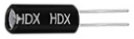 |
|             Photoresistor             |      3       |  |
|             Flame Sensor              |      1       |  |
|       LM35DZ Temperature Sensor       |      1       |  |
|             74HC595N Chip             |      1       |  |
|              L293D Chip               |      1       | 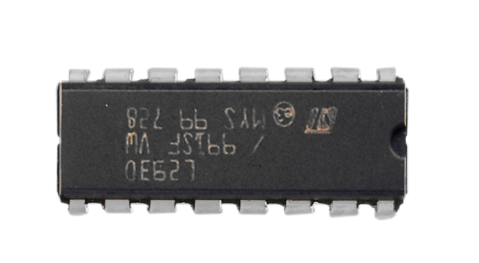 |
|    1 Digit 7-segment  LED Display     |      1       |  |
|    4 Digit 7-segment  LED Display     |      1       |  |
|          8*8 LED Dot Matrix          |      1       |  |
|           1602 LCD Display            |      1       | 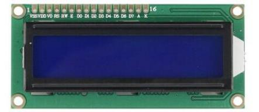 |
|                 Servo                 |      1       |  |
|         ULN2003 Driver Board          |      1       |  |
|           5V Stepper Motor            |      1       |  |
|     PCF8591 A/D Converter Module      |      1       |  |
|            Joystick Module            |      1       |  |
|             Relay Module              |      1       |  |
|             Sound Module              |      1       |  |
|           PIR Motion Sensor           |      1       |  |
|        MQ-2 Analog Gas Sensor         |      1       | 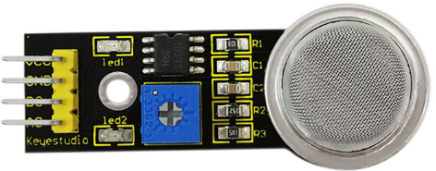 |
|       HC-SR04 Ultrasonic Sensor       |      1       |  |
| DHT11 Temperature and Humidity Sensor |      1       |  |
|         Soil Humidity Sensor          |      1       |  |
|          Water Level Sensor           |      1       |               |
|                 Motor                 |      1       |  |
|              Water Pump               |      1       |  |
|                  Fan                  |      1       |  |
|              Water Pipe               |      1       |  |
|          830-Hole Breadboard          |      1       |  |
|      Male to Female  DuPont Line      |      20      |  |
|              Jumper Wire              |      30      | 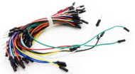 |
|              40-Pin Line              |      1       |  |
|              Screwdriver              |      1       |               |
|     Resistance Color  Code Table      |      1       |  |

## 3.Install Raspberry Pi OS System：

**Hardware Tool**

-   Raspberry Pi 4B/3B/2B

-   Above 8G TFT SD Card

-   Card Reader

-   Computer and other parts

**Software Tool**

**Windows System：**

Install putty firstly:

Download Putty：[https://www.chiark.greenend.org.uk/\~sgtatham/putty/](https://www.chiark.greenend.org.uk/~sgtatham/putty/)

a. After downloading the driver file，double-click it and tap“Next”

b. Click“Next”

c. Select“Install Putty files”and click“Install”.

d. After a few seconds, click“Finish”.

**SSH Remote Login software -WinSCP**

Download WinSCP: <https://winscp.net/eng/download.php>

a.  After the download, clickand
    .

b. Click“Accept”

c. Follow the below steps to finish the installation.

**SD Card Formatter**

Format TFT card tool

Download SD Card Formatter ：

http://www.canadiancontent.net/tech/download/SD_Card_Formatter.html

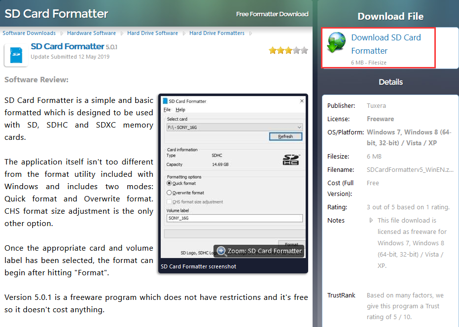

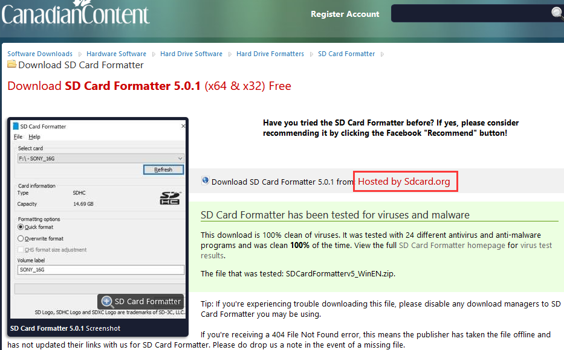

a. Unzip the SDCardFormatterv5_WinEN package, double-click to run it.

b. Click“Next”and choose, then tap“Next”

c. Click“Next”and“Install”.

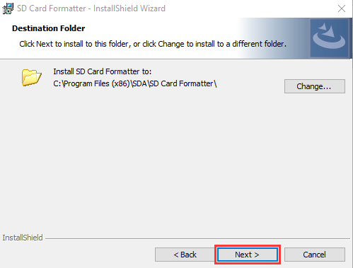

d. After a few seconds, click“Finish”

**Win32DiskImager**

Download Link：https://sourceforge.net/projects/win32diskimager/

a. After the download, double-click and tap“Run”

b. Select  and tap“Next”.

c. Click“Browse...”and find out the folder where the Win32DiskImager is located,
tap“Next”.

d. Tick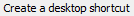, click“Next”and“Install”

e. After a few seconds, click“Finish”.

f. The installation is finished

Scan to search ip address software tool---WNetWatcher

Download Link：http://www.nirsoft.net/utils/wnetwatcher.zip

**Raspberry Pi Imager**

Download Address：

<https://www.raspberrypi.org/downloads/raspberry-pi-os/>

(recommend downloading the version with desktop and commonly used software)

## 4.Install Raspberry Pi OS on Raspberry Pi 4B

Insert TFT RAM card to card reader, then interface card reader to USB port of computer.

Format TFT RAM card with SD Card Formatter software, as shown below:

**(1) Burn System**

Burn the Raspberry Pi OS system to TFT card using Win32DiskImager software

Don’t eject card reader after burning mirror system, build a file named SSH, then delete .txt.

The SSH login function can be activated by copying SSH file to boot category, as shown below.

**(2) Eject Card Reader**

Log in system（raspberry and PC should be in the same local area network）

Insert TFT card into Raspberry, connect internet cable and plug in power.

If you have screen and HDMI cable of Raspberry Pi, you could view Raspberry Pi
OS system activating.

If not, you can enter the desktop of Raspberry Pi via SSH remote login
software---WinSCP and xrdp login.

**(3) Remote Login**

**Enter default user name, password and host name on WinSCP to log in.**

**Only a Raspberry Pi is connected in same network.**

**(4) Check ip and mac address**

Click to open terminal input the password：raspberry, and press“Enter”on keyboard.

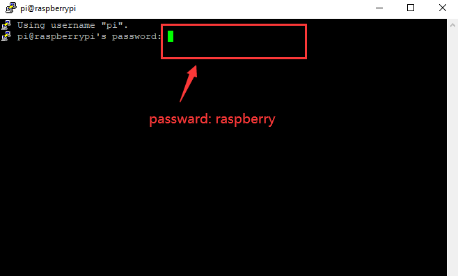

Logging in successfully, open the terminal, input ip a and tap“Enter”to check ip and mac address.

Form the above figure, mac address of this Raspberry Pi is a6:32:17:61:9c, and ip address is 192.168.1.128(use ip address to finish xrdp login)

Since mac address never changes, you could confirm ip via it.

**(5) Fix ip address of Raspberry Pi**

Ip address is changeable, therefore, we need to make ip address fixed for convenient use.

Follow the below steps：

Switch to root user If without root user’s password

①Set root password

Input password in the terminal：**sudo passwd root** to set password

②Switch to root user **su root**

③ Fix the configuration file of ip address

Firstly change ip address of the following configuration file

**（\#New ip address：address 192.168.1.99）**

Copy the above new address to terminal and press“Enter”

**Configuration File：**

echo -e '

auto eth0

iface eth0 inet static

\#Change IP address

address 192.168.1.99

netmask 255.255.255.0

gateway 192.168.1.1

network 192.168.1.0

broadcast 192.168.1.255

dns-domain 119.29.29.29

dns-nameservers 119.29.29.29

metric 0

mtu 1492

'\>/etc/network/interfaces.d/eth0

As shown below:

④Reboot the system and activate the configuration file

Input the restart command in the terminal: **sudo reboot**

You could log in via fixed ip afterwards.

⑤Check IP and insure ip address fixed well

**(6) Log in Desktop on Raspberry Pi Wirelessly**

In fact, we can log in desktop on Raspberry Pi Wirelessly even without screen and HDMI cable.

VNC and Xrdp are commonly used to log in desktop of Raspberry Pi wirelessly. Let’s take example of Xrdp.

**(7) Install Xrdp Service in the terminal**

Install Command：

Switch to Root User: su root

Install ：apt-get install xrdp

Enter y and press “Enter”

As shown below:

**Open the remote desktop connection on Windows**

Press WIN+R on keyboard and enter mstsc.exe

As shown below：

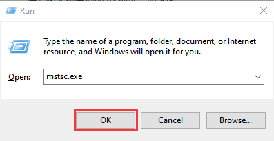

Input ip address of Raspberry Pi, as shown below.

Click“Connect”and tap“Connect”.

192.168.1.99 is ip address we use, you could change into yours ip address.

Click“Yes”.

Input user name: pi, default password: raspberry, as shown below:

Click“OK”or“Enter”, you will view the desktop of Raspberry Pi OS, as shown below:

Now, we finish the basic configuration of Raspberry Pi OS

## 5.Resources：

1.  <https://projects.raspberrypi.org/en/projects/raspberry-pi-setting-up/6>

2.  <https://wiki.keyestudio.com/KS3001(3002,_3003,.....3012%EF%BC%89Raspberry_Pi_Complete_Device_Kit>

3.  <https://www.raspberrypi.org/documentation/installation/installing-images/README.md>

4.  <https://www.raspberrypi.org/software/>

5.  https://fs.keyestudio.com/KS3014
