# **Python Tutorial**


## Preparations for Python

Python is a programming language that lets you work more quickly and integrate your systems more effectively.

Python is an interpreted, high-level and general-purpose programming language. Python's design philosophy emphasizes code readability with its notable use of significant whitespace. Its language constructs and object-oriented approach aim to help programmers write clear, logical code for small and large-scale projects.

Next to pick up Python to control 40 pin of Raspberry Pi.

### Hardware：

| ***\*Raspberry Pi 4B\****                                    | ***\*Raspberry Pi 4B Model\**** |
| ------------------------------------------------------------ | ------------------------------- |
| | 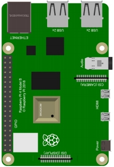        |


**Hardware Interfaces：**


**40-Pin GPIO Header Description：**

GPIO pins are divided into BCM GPIO number, physics number and WiringPi GPIO number.

We usually use WiringPi GPIO when using C language and BCM GPIO and physics number are used to Python, as shown below;

In these lessons, we use Python, so BCM GPIO number is adopted.


<span style="color: rgb(255, 76, 65);">Note:</span> pin(3.3 V) on the left hand is square, but other pins are round. Turn Raspberry Pi over, there is a square GPIO on the back.(you could tell from pin(3.3V).


Note: the largest current of each pin on Raspberry Pi 4B is 16mA and the aggregate current of all pins is not less than 51mA.

### GPIO Extension Board：

This extension board is led out by 40-pin headers of Raspberry Pi for convenient connection.

Note: the silk mark is also printed according to BCM GPIO number.


Connection Diagram

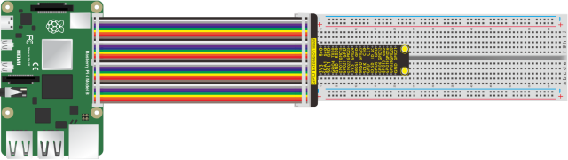

### Copy Example Code Folder to Raspberry Pi：

Place example code folder to the pi folder of Raspberry Pi. and extract the example code from <span style="color: rgb(255, 76, 65);">pythonCode_A</span> zip file, as shown below:


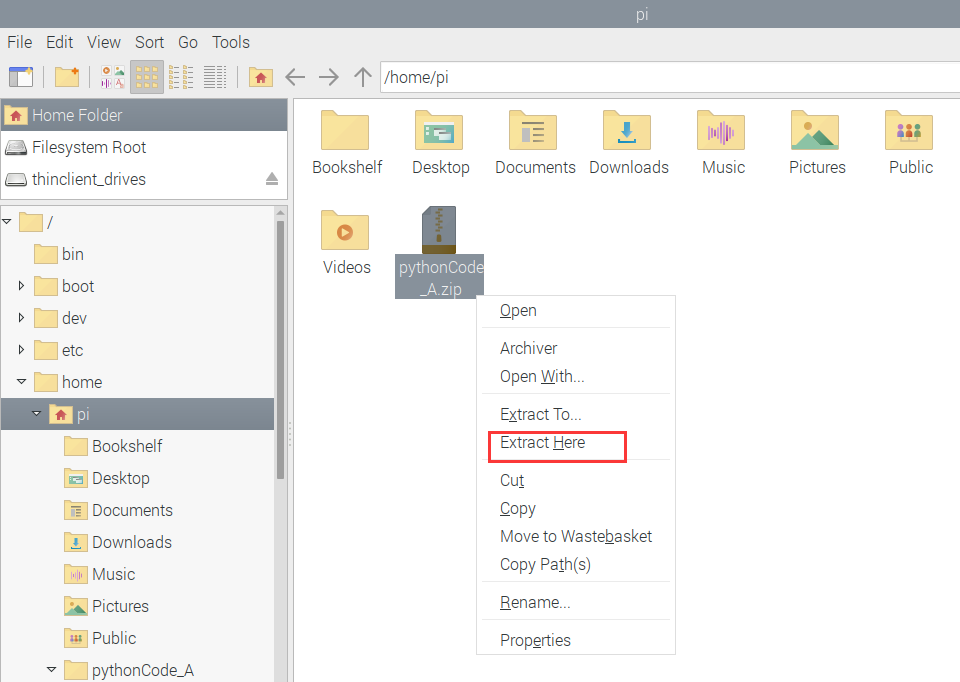

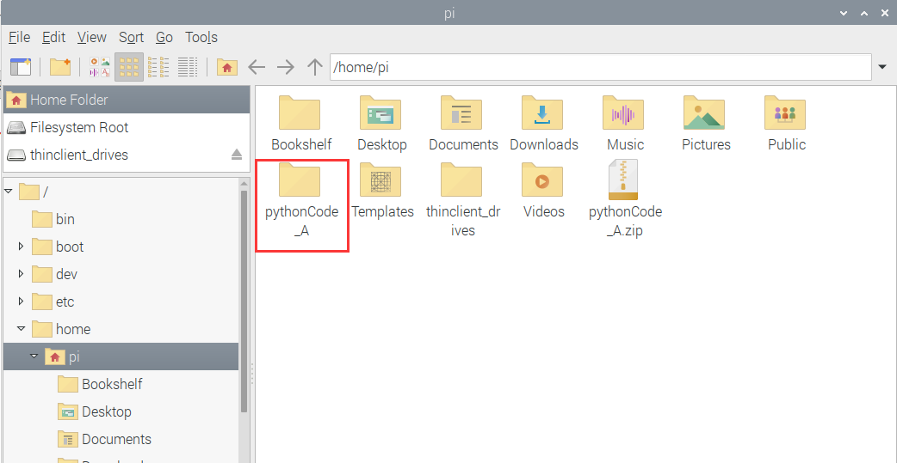

Double-click pythonCode_A folder to look through compiled files, as shown below:

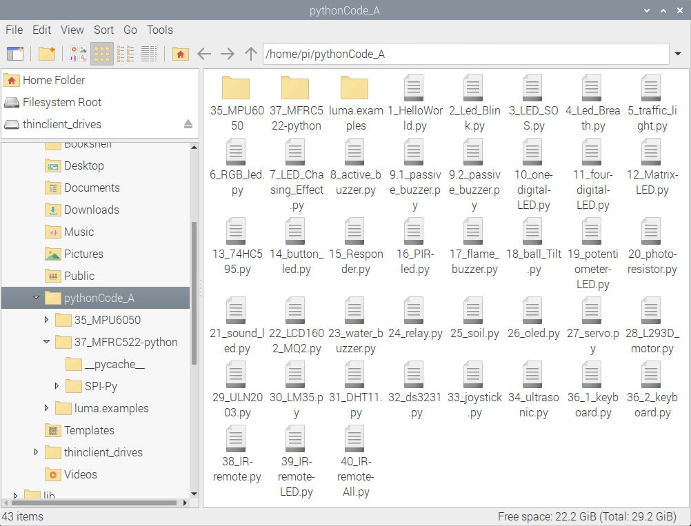

Set the default editor of file with <span style="color: rgb(255, 76, 65);">.py</span> .

Right-click“**Open with...**”.

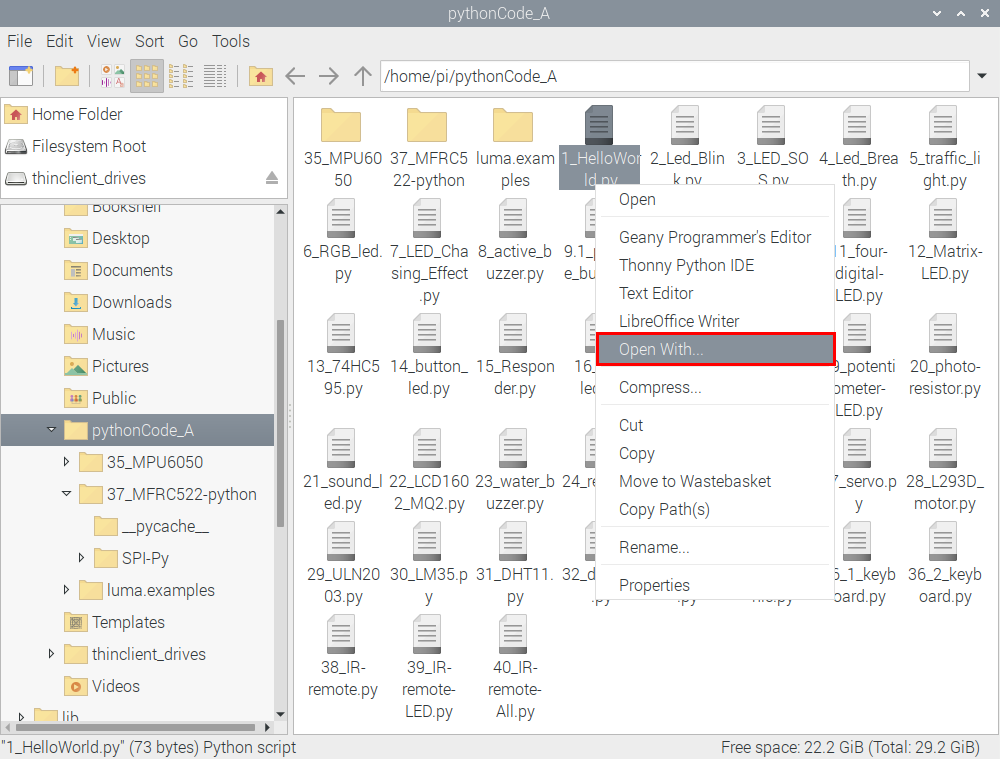

Click "**Programming**" to select "**Geany Programmer’s Editor**".


Then, we can directly open file by doubl-click "**Geany Programmer’s Editor**".

**Print“Hello World”**

One is to double-click 1_HelloWorld.py and tap to compile code and check grammar errors. After successful compilation, tap to run the code. At same time, terminal appears and prints“hello world”.

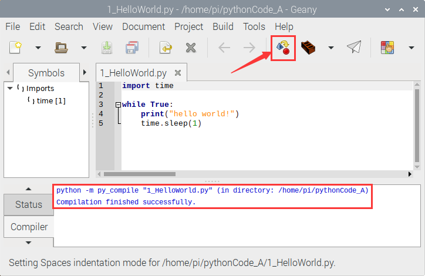

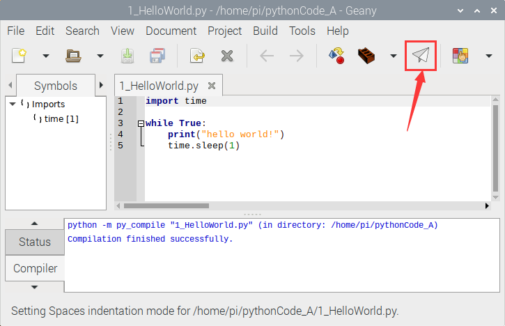

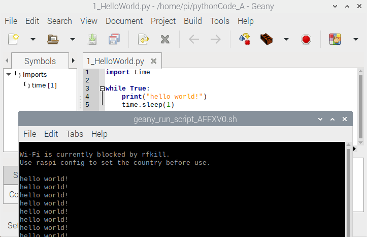

The other way is to open terminal directly, input the following commands and press“**Enter**”to print“**hello world!**”:

cd pythonCode_A

python 1_HelloWorld.py


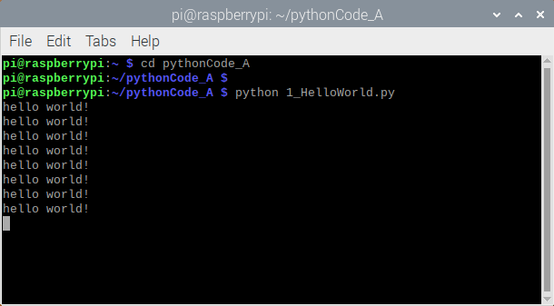

## Projects：

**<span style="color: rgb(255, 76, 65);">Note:</span> G, - and GND marked on sensors and modules are so-called negative, which are connected to GND of GPIO extension board or “-” of breadboard; V、+、VCC are known as positive, which are interfaced 3V3 or 5V on extension board and“+”on breadboard**

### Project 1： Python3 Shell

Use windows remote desktop connection to enter the page of Raspberry Pi, then open its terminal.

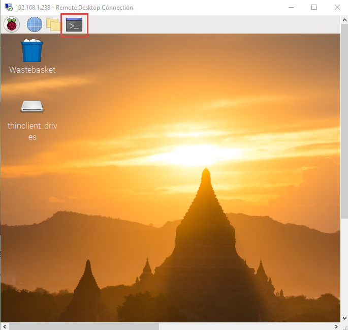

Input python3 in terminal and enter the python3 shell interface, then input **print(“hello,world!”)** and press“**Enter**”, “**hello,world!**” will be output.

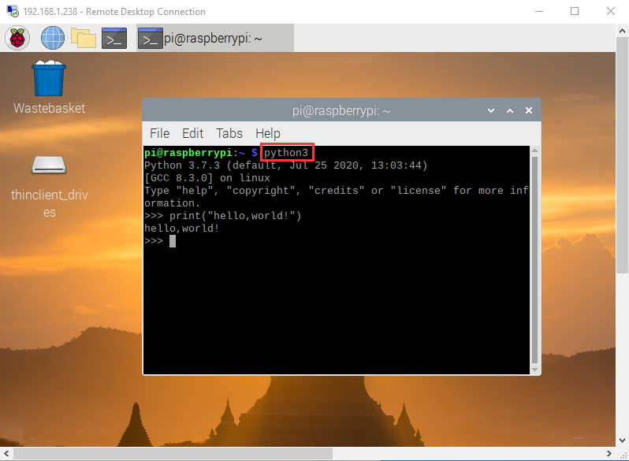

You may find function print() is used to print data.

You could print other type data, like Mathematical formula:

print(1+5)

Variable a = 2 b = 5

print(a\*b)

As shown below:

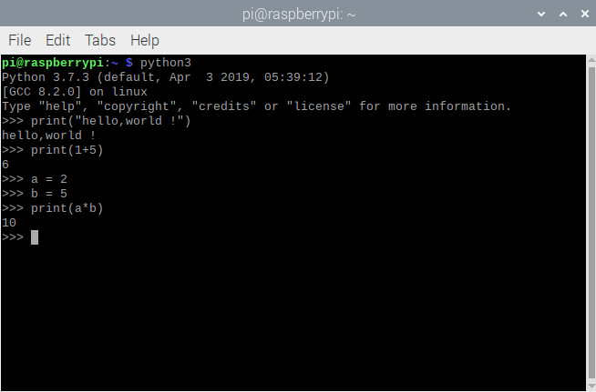

Input **exit()** to exit python3 shell

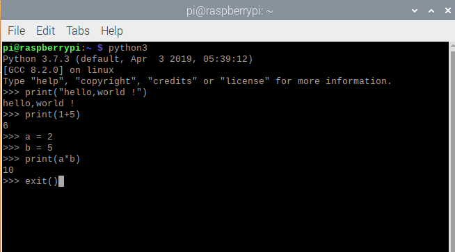

### Project 2： LED Blinks

#### 1. Description：

Let’s start from a rather basic and simple experiment----LED Blinks.

#### 2. Components：

| 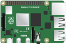 |  |  |  |  |  |  |
| ------------------------------------------------------------ | ------------------------------------------------------------ | ------------------------------------------------------------ | ------------------------------------------------------------ | ------------------------------------------------------------ | ------------------------------------------------------------ | ------------------------------------------------------------ |
| Raspberry Pi*1                                               | GPIO Extension Board*1                                       | 40pin Colorful Jumper Wires*1                                | Breadboard*1                                                 | LED - Red *1                                                 | 220Ω Resistor*1                                              | Jumper Wires                                                 |

#### 3. Component Description：

**LED**: A light-emitting diode, the current is connected when anode(long pin) is connected to VCC, and cathode(short pin)is connected to GND. Its brightness is 2V and current is 6mA. LED must be connected to a resistor in the circuit, otherwise, the components will be burned.

**Resistor**: we use a carbon film resistor, 220Ωand its accuracy is 5%, why choose 220Ω resistor?

Since the high-level output voltage of GPIO pin of the Raspberry Pi is 3.3V, and the voltage of the LED is about 2V, and the current is about 6mA, we need to use a resistor to bear the voltage (3.3V-2V) = 1.3V, according to ohm The law: U/I =R knows: (3.3-2)/6 \* 1000 ≈ 217Ω.

**Breadboard**: Below is a short instruction of breadboard. The holes on the board are connected. The inner board is structure diagram.


#### 4. Schematic Diagram：


**Connection Diagram**


Since the PIN numbers of GPIO Extension Board and RPi GPIO are same, the part of breadboard and GPIO Extension Board is only shown on further connection diagram.


#### 5. Working Principle：

The positive pole of LED is connected to GPIO18, when the pin of GPIO18 outputs 3.3V, LED will be on; when its pin outputs 0V, LED will be off.

#### 6. Run Example Code:

Input the following commands in the terminal and press“Enter”:

cd /home/pi/pythonCode_A

python 2_Led_Blink.py

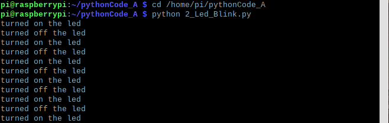

#### 7. Test Results：

Terminal prints and LED flashes.

<span style="color: rgb(255, 76, 65);">Note:</span> Press Ctrl + C on keyboard and exit code running.


#### 8. Example Code：

```python
import RPi.GPIO as GPIO
import time

ledPin = 18  ##define led pin

GPIO.setmode(GPIO.BCM)        ## use BCM numbers
GPIO.setup(ledPin,GPIO.OUT)   ##set the ledPin OUTPUT mode
GPIO.output(ledPin,GPIO.LOW)  ## make ledPin output LOW level

while True:    ##loop
    GPIO.output(ledPin,GPIO.HIGH)  ##turn on led
    print("turned on the led")  ##Print in the terminal
    time.sleep(1)              ##wait for 1 second
    GPIO.output(ledPin,GPIO.LOW)   ##turn off led
    print("turned off the led")
    time.sleep(1)

GPIO.cleanup()    ##release all GPIO
```

#### 9. Explanation：

| While                   | While is the loop statement of python，when the condition is true, the program will be executed always be executed.                                                                                                                                                                                                           |
|-------------------------|-------------------------------------------------------------------------------------------------------------------------------------------------------------------------------------------------------------------------------------------------------------------------------------------------------------------------------|
| import RPi.GPIO as GPIO | Import RPi.GPIO library，which can be used to control the digital output of Raspberry Pi and PWM output. GPIO.setmode(GPIO.BCM) There are many definitions about pins of Raspberry Pi, on this condition, we definite pin as BCM digital pin More resource： [https://sourceforge.net/p/raspberry-gpio-python/wiki/Examples/](https://sourceforge.net/p/raspberry-gpio-python/wiki/Examples/) |
| import time             | Import time library, time.sleep(1) means waiting for a second, more resource： [https://sourceforge.net/p/raspberry-gpio-python/wiki/Examples/](https://sourceforge.net/p/raspberry-gpio-python/wiki/Examples/)                                                                                                                                                                              |

### Project 3： SOS Light

#### 1. Description：

S.O.S is a Morse code distress signal , used internationally, that was originally established for maritime use. We will present it with flashing LED.

#### 2. Components:

|  |  |  |  |  |  |  |
| ------------------------------------------------------------ | ------------------------------------------------------------ | ------------------------------------------------------------ | ------------------------------------------------------------ | ------------------------------------------------------------ | ------------------------------------------------------------ | ------------------------------------------------------------ |
| Raspberry Pi*1                                               | GPIO Extension Board*1                                       | 40pin Colorful Jumper Wires*1                                | Breadboard*1                                                 | LED - Red *1                                                 | 220Ω Resistor*1                                              | Jumper Wires                                                 |

#### 3. Schematic Diagram：


**Connection Diagram**


#### 4. Run Example Code：

Input the following commands and press "Enter":

cd /home/pi/pythonCode_A

python 3_LED_SOS.py

#### 5. Test Results：

LED flashes quickly for three times, three times slowly and quickly three times, the terminal prints ... \_ \_ \_ ... 

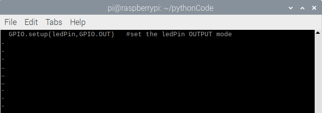

<span style="color: rgb(255, 76, 65);">Note:</span> Press Ctrl + C on keyboard and exit code running.

#### 6. Example Code:

```python
import RPi.GPIO as GPIO
import time

ledPin = 18  ##define led pin
i1 = 0
i2 = 0
i3 = 0

GPIO.setmode(GPIO.BCM)        ## use BCM numbers
GPIO.setup(ledPin,GPIO.OUT)   ##set the ledPin OUTPUT mode
GPIO.output(ledPin,GPIO.LOW)  ## make ledPin output LOW level

while True:    ##loop
    while(i1<3):
        GPIO.output(ledPin,GPIO.HIGH)  ##turn on led
        time.sleep(0.1)              ##wait for 1 second
        GPIO.output(ledPin,GPIO.LOW)   ##turn off led
        time.sleep(0.1)
        print(".")
        i1 += 1
    
    while(i2<3):
        GPIO.output(ledPin,GPIO.HIGH)  ##turn on led
        time.sleep(1)              ##wait for 1 second
        GPIO.output(ledPin,GPIO.LOW)   ##turn off led
        time.sleep(1)
        print("_")
        i2 += 1
    
    while(i3<3):
        GPIO.output(ledPin,GPIO.HIGH)  ##turn on led
        time.sleep(0.1)              ##wait for 1 second
        GPIO.output(ledPin,GPIO.LOW)   ##turn off led
        time.sleep(0.1)
        print(".")
        i3 += 1
    time.sleep(3)
    i1 = 0
    i2 = 0
    i3 = 0
    

GPIO.cleanup()    ##release all GPIO
```

### Project 4： Breathing LED

#### 1. Description：

A“breathing LED”is a phenomenon where an LED's brightness smoothly changes from dark to bright and back to dark, continuing to do so and giving the illusion of an LED“breathing.”This phenomenon is similar to a lung breathing in and out. So how to control LED’s brightness? We need to take advantage of PWM.

#### 2. Components：

|  |  |  |  |  |  |  |
| ------------------------------------------------------------ | ------------------------------------------------------------ | ------------------------------------------------------------ | ------------------------------------------------------------ | ------------------------------------------------------------ | ------------------------------------------------------------ | ------------------------------------------------------------ |
| Raspberry Pi*1                                               | GPIO Extension Board*1                                       | 40 pin Colorful Jumper Wires*1                               | Breadboard*1                                                 | LED - Red *1                                                 | 220ΩResistor *1                                              | Jumper Wires                                                 |

#### 3. Working Principle：

We use the PWM output of GPIO, PWM outputs analog signals and output value is 0\~100 which is equivalent to output voltage 0\~3.3V from GPIO port.

According to Ohm's law: U/R = I, the resistance is 220Ω, and the value of voltage U changes, so does the value of current I, which can control the brightness of the LED lamp.

PWM (Pulse Width Modulation) is the control of the analog circuit through the digital output of microcomputer and a method that making digital coding on analog signal levels

It sends square waves with certain frequency through digital pins, that is, high level and low level are output alternately for a period of time. Total time of each group high and low level is fixed, which is called cycle.

The time of high level output is pulse width whose percentage is called Duty Cycle. The longer that high level lasts, the larger the duty cycle of analog signals is, the corresponding voltage as well

Below chart is pulse width 50%, then the output voltage is 3.3 \* 50% = 1.65V，the brightness of LED is medium.


#### 4. Schematic Diagram：


**Connection Diagram**


#### 5. Run Example Code：

Input the following commands and press "Enter":

cd /home/pi/pythonCode_A

python 4_Led_Breath.py

#### 6. Test Results：

LED gradually brightens then darkens.

<span style="color: rgb(255, 76, 65);">Note:</span> Press Ctrl + C on keyboard and exit code running.

#### 7. Example Code：

```python
import RPi.GPIO as GPIO
import time

ledPin = 18  ##define led pin

GPIO.setmode(GPIO.BCM)  ## use BCM numbers
GPIO.setup(ledPin,GPIO.OUT) ##set the ledPin OUTPUT mode
GPIO.output(ledPin,GPIO.LOW)  ## make ledPin output LOW level
pwm = GPIO.PWM(18,100)  ##create a PWM instance
pwm.start(0)   ##start PWM

def brighten():  ##define function
    for i in range(0,100,+1):
        pwm.ChangeDutyCycle(i)  ##change the frequency,To lighten gradually
        time.sleep(0.01)
        
def darken(): 
    for i in range(100,0,-1):
        pwm.ChangeDutyCycle(i) ##To darken gradually
        time.sleep(0.01)
    
while True:     ##loop
    brighten()  ##call function
    darken()

pwm.stop()  ##stop PWM

GPIO.cleanup()    ##release all GPIO
```

### Project 5：Traffic Lights

#### 1. Description：

In this lesson, we will learn how to control multiple LED lights and simulate the operation of traffic lights.

Traffic lights are signalling devices positioned at road intersections, pedestrian crossings, and other locations to control flows of traffic.

Green light on: Allows traffic to proceed in the direction denoted, if it is safe to do so and there is room on the other side of the intersection.

Red light: Prohibits any traffic from proceeding. A flashing red indication requires traffic to stop and then proceed when safe (equivalent to a stop sign).

Amber light (also known as 'orange light' or 'yellow light'):

Warns that the signal is about to change to red, with some jurisdictions requiring drivers to stop if it is safe to do so, and others allowing drivers to go through the intersection if safe to do so.

#### 2. Components：

|  |  |  |  |  | 
| ------------------------------------------------------------ | ------------------------------------------------------------ | ------------------------------------------------------------ | ------------------------------------------------------------ | ------------------------------------------------------------ |
| Raspberry Pi*1                                               | GPIO Extension Board*1                                       | 40 pin Colorful Jumper Wires*1                               | Breadboard*1                                                 | LED - Red *1                                                 |
|  | |  |  |                                                              |
| LED - Green*1                                                | LED - Yellow*1                                               | 220Ω Resistor*3                                              | Jumper Wires                                                 |                                                              |

#### 3. Schematic Diagram：


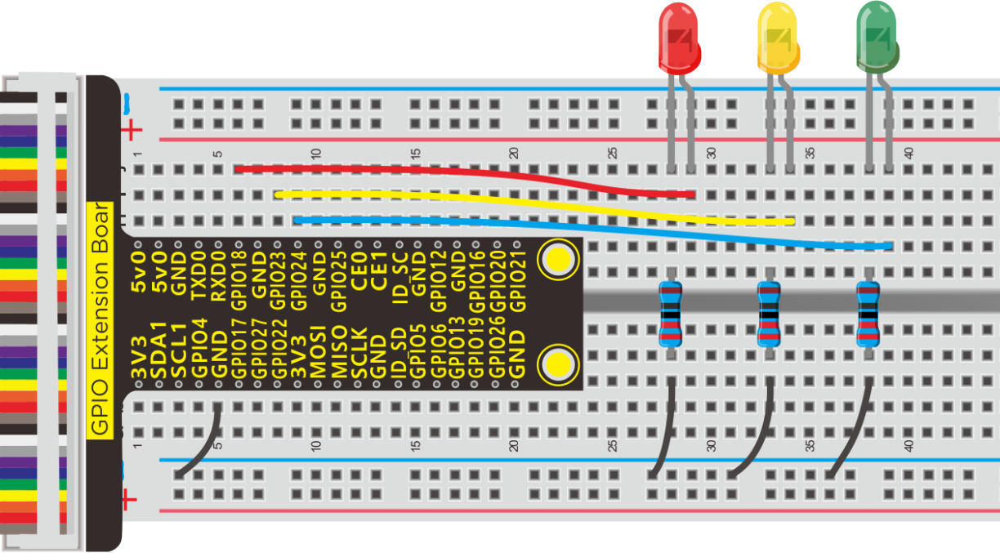

#### 4. Run Example Code：

Input the following commands and press "Enter":

cd /home/pi/pythonCode_A

python 5_traffic_light.py

#### 5. Test Results：

Red light is on 5s and off, yellow light flashes 3s and turn off, green light is
lit for 5s and off, in loop way.

<span style="color: rgb(255, 76, 65);">Note:</span> Press Ctrl + C on keyboard and exit code running.

#### 6. Example Code：
```python
import RPi.GPIO as GPIO
from time import sleep

##LED pin
red = 18
yellow = 23
green = 24

GPIO.setmode(GPIO.BCM)  ## use BCM numbers
GPIO.setup(red,GPIO.OUT)  ##set the ledPin OUTPUT mode
GPIO.setup(yellow,GPIO.OUT)
GPIO.setup(green,GPIO.OUT)

GPIO.output(red,GPIO.LOW)
GPIO.output(yellow,GPIO.LOW)
GPIO.output(green,GPIO.LOW)

while True:
    GPIO.output(red,GPIO.HIGH)
    sleep(5)
    GPIO.output(red,GPIO.LOW)
    
    GPIO.output(yellow,GPIO.HIGH) ##turn on yellow_led
    sleep(0.5)
    GPIO.output(yellow,GPIO.LOW) ##turn off yellow_led
    sleep(0.5)
    GPIO.output(yellow,GPIO.HIGH)
    sleep(0.5)
    GPIO.output(yellow,GPIO.LOW) 
    sleep(0.5)
    GPIO.output(yellow,GPIO.HIGH) 
    sleep(0.5)
    GPIO.output(yellow,GPIO.LOW) 
    sleep(0.5)
    
    GPIO.output(green,GPIO.HIGH)  ##turn on green_led
    sleep(5)     ##delay 5s
    GPIO.output(green,GPIO.LOW)   ##turn off green_led
    
    
GPIO.cleanup()   ##release all GPIO
```

### Project 6：RGB Light

#### 1. Description：

In this chapter, we will demonstrate how RGB lights show different colors via programming.

#### 2. Components：

|  |  |  | |   |  |  |
| ------------------------------------------------------------ | ------------------------------------------------------------ | ------------------------------------------------------------ | ------------------------------------------------------------ | ------------------------------------------------------------ | ------------------------------------------------------------ | ------------------------------------------------------------ |
| Raspberry Pi*1                                               | GPIO Extension Board*1                                       | 40 pin ColorfulJumper Wires*1                                | Breadboard*1                                                 | RGB - LED *1                                                 | 100Ω Resistor*3                                              | Jumper Wires                                                 |

#### 3. Component Knowledge：

We use common cathode RGB lights.

**Working Principle：**

RGB LED integrated three LEDs emitting red,green and blue light. It has 4 pins，long pin (-) is a shared pin, that is, the negative port of 3LED, as shown below, we control three LEDs to emit light with different brightness to make RGB show different colors.

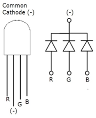

Red, green and blue are three primary colors. They could produce all kinds of visible lights when mixing them up. Computer screen, single pixel mobile phone screen, neon light work under this principle.

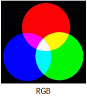

Next, we will make a RGB LED displaying all kinds of colors

#### 4. Schematic Diagram：


#### 5. Run Example Code：

Input the following commands and press "Enter":

cd /home/pi/pythonCode_A

python 6_RGB_led.py

#### 6. Test Results：

RGB lights show colors randomly.

<span style="color: rgb(255, 76, 65);">Note:</span> Press Ctrl + C on keyboard and exit code running.

#### 7. Example Code：

```python
import RPi.GPIO as GPIO
from time import sleep
import random

##define RGB pin
pin_R = 24
pin_G = 23
pin_B = 18
GPIO.setmode(GPIO.BCM)  ## use BCM numbers
##set the RGB Pin OUTPUT mode
GPIO.setup(pin_R,GPIO.OUT)
GPIO.setup(pin_G,GPIO.OUT)
GPIO.setup(pin_B,GPIO.OUT)

## makeRGB Pin output LOW level
GPIO.output(pin_R,GPIO.HIGH)
GPIO.output(pin_G,GPIO.HIGH)
GPIO.output(pin_B,GPIO.HIGH)

##set pwm frequence to 1000hz
pwm_R = GPIO.PWM(pin_R,100)
pwm_G = GPIO.PWM(pin_G,100)
pwm_B = GPIO.PWM(pin_B,100)
##set inital duty cycle to 0
pwm_R.start(0)
pwm_G.start(0)
pwm_B.start(0)

##function. receive the value to display different colors
def setColor(val_R,val_G,val_B):
    pwm_R.ChangeDutyCycle(val_R)
    pwm_G.ChangeDutyCycle(val_G)
    pwm_B.ChangeDutyCycle(val_B)

while True:
    ## get a random in 0~100
    R = random.randint(0,100)
    G = random.randint(0,100)
    B = random.randint(0,100)
    setColor(R,G,B)  ##set the color value
    print('Red=%d, Green = %d, Blue = %d' %(R, G, B))
    sleep(0.2)
    
##stop pwm
pwm_R.stop()
pwm_G.stop()
pwm_B.stop()

GPIO.cleanup()  ##release all GPIO
```

### Project 7： Flow Light

#### 1. Description：

What is flow light? Maybe you see it on the wall of buildings and billboards. It is a scene that LED gradually brightens then darkens one by one.

#### 2. Components：

|   |  |  |  |  |  |  |
| ------------------------------------------------------------ | ------------------------------------------------------------ | ------------------------------------------------------------ | ------------------------------------------------------------ | ------------------------------------------------------------ | ------------------------------------------------------------ | ------------------------------------------------------------ |
| Raspberry Pi*1                                               | GPIO Extension Board*1                                       | 40 pin Colorful Jumper Wires*1                               | Breadboard*1                                                 | LED - Red *8                                                 | 220Ω Resistor*8                                              | Jumper Wires                                                 |

 

#### 3. Schematic Diagram：

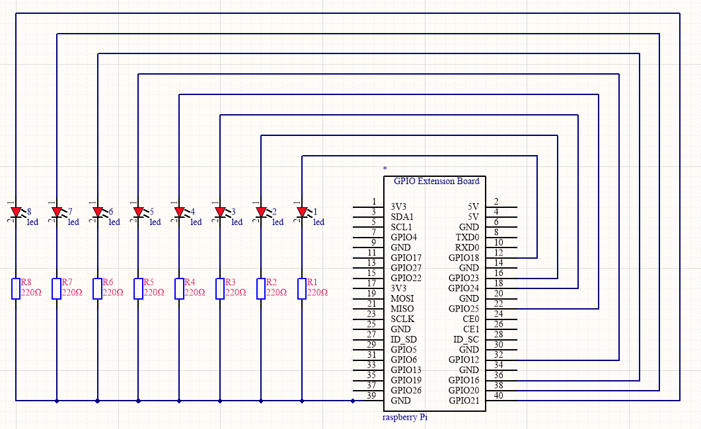
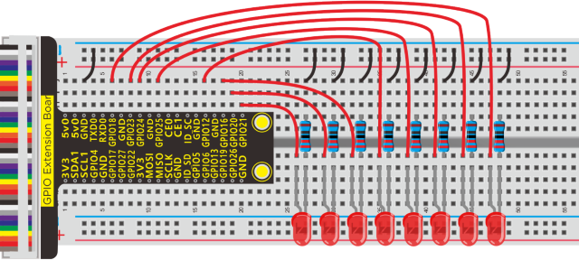

#### 4. Run Example Code：

Input the following commands and press "Enter":

cd /home/pi/pythonCode_A

python 7_LED_Chasing_Effect.py

#### 5. Test Results：

Eight LED lights change from light to dark then back to dark, one by one.

<span style="color: rgb(255, 76, 65);">Note:</span> Press Ctrl + C on keyboard and exit code running.

#### 6. Example Code：

```python
import RPi.GPIO as GPIO
from time import sleep

##LED pin
led1 = 18
led2 = 23
led3 = 24
led4 = 25
led5 = 12
led6 = 16
led7 = 20
led8 = 21


GPIO.setmode(GPIO.BCM) ## use BCM numbers
##set the ledPin OUTPUT mode
GPIO.setup(led1,GPIO.OUT)
GPIO.setup(led2,GPIO.OUT)
GPIO.setup(led3,GPIO.OUT)
GPIO.setup(led4,GPIO.OUT)
GPIO.setup(led5,GPIO.OUT)
GPIO.setup(led6,GPIO.OUT)
GPIO.setup(led7,GPIO.OUT)
GPIO.setup(led8,GPIO.OUT)

while True:
    ##Led lights are lit one by one
    GPIO.output(led1,GPIO.HIGH)
    sleep(0.2)   ## the delay size to control the speed of the water lamp 
    GPIO.output(led2,GPIO.HIGH)
    sleep(0.2)
    GPIO.output(led3,GPIO.HIGH)
    sleep(0.2)
    GPIO.output(led4,GPIO.HIGH)
    sleep(0.2)
    GPIO.output(led5,GPIO.HIGH)
    sleep(0.2)
    GPIO.output(led6,GPIO.HIGH)
    sleep(0.2)
    GPIO.output(led7,GPIO.HIGH)
    sleep(0.2)
    GPIO.output(led8,GPIO.HIGH)
    sleep(0.2)
    
    ##Led lights go out one by one
    GPIO.output(led8,GPIO.LOW)
    sleep(0.2)
    GPIO.output(led7,GPIO.LOW)
    sleep(0.2)
    GPIO.output(led6,GPIO.LOW)
    sleep(0.2)
    GPIO.output(led5,GPIO.LOW)
    sleep(0.2)
    GPIO.output(led4,GPIO.LOW)
    sleep(0.2)
    GPIO.output(led3,GPIO.LOW)
    sleep(0.2)
    GPIO.output(led2,GPIO.LOW)
    sleep(0.2)
    GPIO.output(led1,GPIO.LOW)
    sleep(0.2)

GPIO.cleanup()  ##release all GPIO
```

### Project 8： Doorbell

#### 1. Description：

In this project, we will demonstrate how doorbell works.

#### 2. Components：

|  |  |  |  |
| ------------------------------------------------------------ | ------------------------------------------------------------ | ------------------------------------------------------------ | ------------------------------------------------------------ | 
| Raspberry Pi*1                                               | GPIO Extension Board*1                                       | 40 pin Colorful Jumper Wires*1                               | Breadboard*1                                                 | 
|  |  | 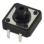 |     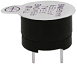                                                          |                                                            
| Jumper Wires                                                 | 10KΩ Resistor*1                                              | Button Switch *1                                             |  Active Buzzer *1                                                                                 |                                                        

#### 3. Components Knowledge:

**Active buzzer：**

An active buzzer will generate a tone using an internal oscillator, so all that is needed is a DC voltage. A passive buzzer requires an AC signal to make a sound. It is like an electromagnetic speaker, where a changing input signal produces the sound, rather than producing a tone automatically.

As a type of electronic buzzer with integrated structure, buzzers, which are supplied by DC power, are widely used in computers, printers, photocopiers, alarms, electronic toys, automotive electronic devices, telephones, timers and other electronic products for voice devices. Buzzers can be categorized as active and passive ones (see the following picture). Turn the pins of two buzzers face up, and the one with a green circuit board is a passive buzzer, while the other enclosed with a black tape is an active one.

Button switch: it can control circuit. Before pressed, the current can’t pass from one end to the other end. Both ends are like two mountains. There is a river in between. We can't cross this mountain to another mountain. When pressed, my internal metal piece is

connecting the two sides to let the current pass, just like building a bridge to connect the two mountains. Inner structure:, 1 and 1 , 2 and 2 are connected , however, 1 and 2 are disconnected when the button is not
pressed; 1 and 2 are connected when pressing the button.

**10KΩ resistor**：

It is pull-up resistor. The high and low levels of Raspberry Pi will be unstable if connecting only GPIO pins instead of resistors.

Resistor could stabilize the electronic signal and protect circuit.

The circuit will be shorten and components will be burnt if without wiring 10kΩ resistor, as shown below;

#### 4. Schematic Diagram：

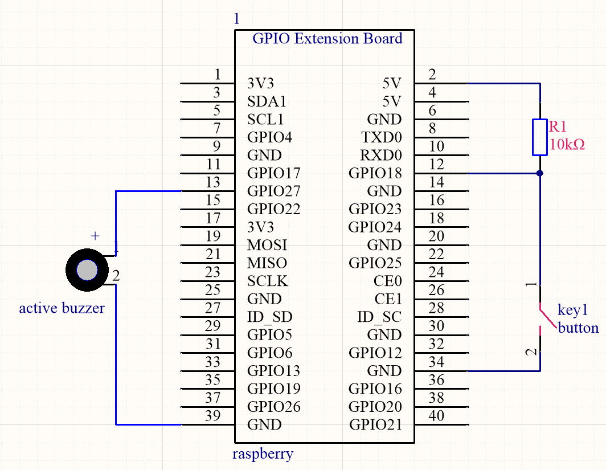

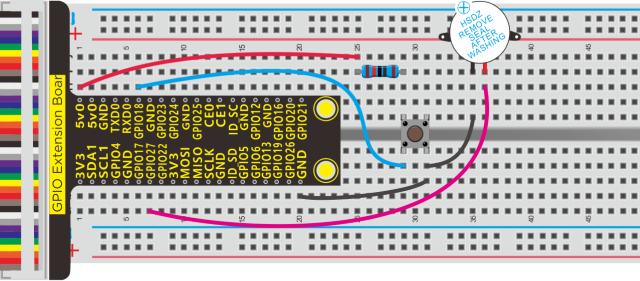

#### 5. Run Example Code：

Input the following commands and press "Enter":

cd /home/pi/pythonCode_A

python 8_active_buzzer.py

#### 6. Test Results：

Press button, the buzzer emits sound, otherwise, it doesn’t.

<span style="color: rgb(255, 76, 65);">Note:</span> Press Ctrl + C on keyboard and exit code running.

#### 7. Example Code：

```python
import RPi.GPIO as GPIO
from time import sleep

##active buzzer pin
buzPin = 27
##button pin
btnPin = 18

GPIO.setmode(GPIO.BCM) ## use BCM numbers
GPIO.setup(buzPin,GPIO.OUT)  ##set buzPin OUTPUT mode
GPIO.setup(btnPin,GPIO.IN,GPIO.PUD_UP)  ## set btnPin INPUT mode

while True:
    val = GPIO.input(btnPin)
    print(val);
    if(val == 0):  ##Judge whether the button is pressed
        GPIO.output(buzPin,GPIO.HIGH)  ##Buzzer ring
    else:
        GPIO.output(buzPin,GPIO.LOW)   ##buzzer off
        
GPIO.cleanup() ## Release all GPIO
```

### Project 9： Passive Buzzer

#### 1. Description：

We will conduct an interesting experiment-----control passive buzzer to compose a song.

#### 2. Components：

|   |  |  |  | 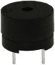 | |
| ------------------------------------------------------------ | ------------------------------------------------------------ | ------------------------------------------------------------ | ------------------------------------------------------------ | ------------------------------------------------------------ | ------------------------------------------------------------ |
| Raspberry Pi*1                                               | GPIO Extension Board*1                                       | 40 pin Colorful Jumper Wires*1                               | Breadboard*1                                                 | Passive Buzzer *1                                            | Jumper Wires                                                 |

#### 3. Component Knowledge

**Passive buzzer**：

Passive buzzer is a type of electronic buzzer with integrated structure.

Buzzers can be categorized as active and passive ones (see the following picture).

An active buzzer has a built-in oscillating source, so it will make sounds when electrified. But a passive buzzer does not have such source, so it will not tweet if DC signals are used; instead, you need to use square waves whose frequency is between 2K and 5K to drive it. The active buzzer is often more expensive than the passive one because of multiple built-in oscillating circuits.

Turn the pins of two buzzers face up, and the one with a green circuit board is a passive buzzer, while the other enclosed with a black tape is an active one, as shown below：
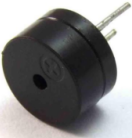

Passive buzzer provides alternating current to sound coils to make electronic magnet and permanent magnet attraction or repulsion so as to push vibration film to emit sound, according to electromagnetic induction.

Only certain frequency with high and low levels can make passive buzzer emit sound, since DC current only makes vibration film vibrated continuously rather than producing sound.

#### 4. Schematic and Connection Diagram


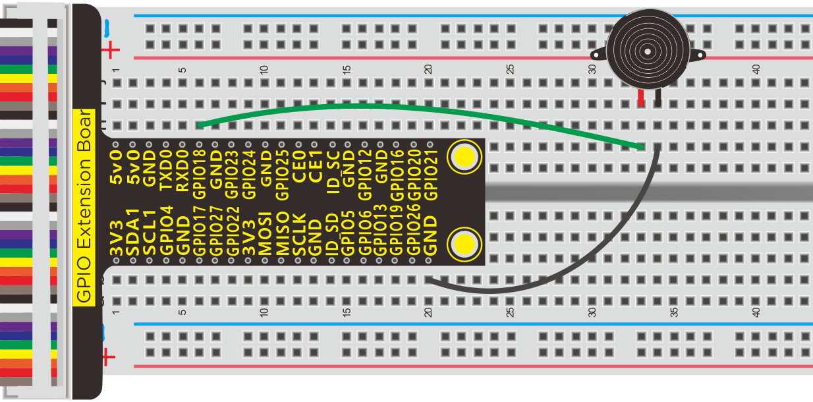

#### 5. Run Example Code1：

Input the following commands and press "Enter":

cd /home/pi/pythonCode_A

python 9.1_passive_buzzer.py

#### 6. Test Results1：

Passive emits“tick,tick”sound.

<span style="color: rgb(255, 76, 65);">Note:</span> Press Ctrl + C on keyboard and exit code running.

#### 7. Example Code1：

```python
##!/usr/bin/env python
## -*- coding: utf-8 -*-

import time
import RPi.GPIO as GPIO

buzPin = 18
i1 = 0
i2 = 0
GPIO.setmode(GPIO.BCM)
GPIO.setup(buzPin, GPIO.OUT)

try:
    while 1:  ##loop
        while(i1<50):
            GPIO.output(buzPin,GPIO.HIGH)
            time.sleep(0.001)              ##wait for 1 ms
            GPIO.output(buzPin,GPIO.LOW)
            time.sleep(0.001)
            i1 = i1 + 1
        time.sleep(0.3)
        while(i2<50):
            GPIO.output(buzPin,GPIO.HIGH)
            time.sleep(0.001)              ##wait for 1 ms
            GPIO.output(buzPin,GPIO.LOW)
            time.sleep(0.001)
            i2 = i2 + 1
        time.sleep(1)
        i1 = 0
        i2 = 0
except KeyboardInterrupt:
    pass
p.stop()  ##stop pwm
GPIO.cleanup() ##release all GPIO
```

#### 8. Run Example Code2：

Input the following commands and press "Enter":

cd /home/pi/pythonCode_A

python 9.2_passive_buzzer.py

#### 9. Test Results2：

Passive buzzer plays a “Happy Birthday”song.

<span style="color: rgb(255, 76, 65);">Note:</span> Press Ctrl + C on keyboard and exit code running.

#### 10. Example Code2：

```c
## -*- coding: utf-8 -*-
import RPi.GPIO as GPIO
import time

Buzzer = 18  ## set the Pin

## Happy birthday
Do = 262  
Re = 294  
Mi = 330  
Fa = 349  
Sol = 392  
La = 440  
Si = 494  
Do_h = 523  
Re_h = 587  
Mi_h = 659  
Fa_h = 698  
Sol_h = 784  
La_h = 880  
Si_h = 988

## The tune
song_1 = [ 
    Sol,Sol,La,Sol,Do_h,Si,
    Sol,Sol,La,Sol,Re_h,Do_h,
    Sol,Sol,Sol_h,Mi_h,Do_h,Si,La,
    Fa_h,Fa_h,Mi_h,Do_h,Re_h,Do_h
]
## delay
beat_1 = [
    0.5,0.5,1,1,1,1+1,
    0.5,0.5,1,1,1,1+1,
    0.5,0.5,1,1,1,1,1,
    0.5,0.5,1,1,1,1+1,
]


def setup():
    GPIO.setmode(GPIO.BCM)       ## Numbers GPIOs by physical location
    GPIO.setup(Buzzer, GPIO.OUT)    ## Set pins' mode is output
    global Buzz                     ## Assign a global variable to replace GPIO.PWM 
    Buzz = GPIO.PWM(Buzzer, 440)    ## 440 is initial frequency.
    Buzz.start(50)                  ## Start Buzzer pin with 50% duty ration

def loop():
    while True:
        print('\n    Playing song 3...')
        for i in range(0, len(song_1)):     ## Play song 1
            Buzz.ChangeFrequency(song_1[i]) ## Change the frequency along the song note
            time.sleep(beat_1[i] * 0.5)     ## delay a note for beat * 0.5s

def destory():
    Buzz.stop()                 ## Stop the buzzer
    GPIO.output(Buzzer, 1)      ## Set Buzzer pin to High
    GPIO.cleanup()              ## Release resource

if __name__ == '__main__':      ## Program start from here
    setup()
    try:
        loop()
    except KeyboardInterrupt:   ## When 'Ctrl+C' is pressed, the child program destroy() will be  executed.
        destory()

```

### Project 10： 1-Digit 7 Segment LED Display

#### 1. Description：

To make LED display numbers, human being invented digital display, in this lesson, we will learn how to control digital display.

#### 2. Components：

|   |  |  |  | |  |  |
| ------------------------------------------------------------ | ------------------------------------------------------------ | ------------------------------------------------------------ | ------------------------------------------------------------ | ------------------------------------------------------------ | ------------------------------------------------------------ | ------------------------------------------------------------ |
| Raspberry Pi*1                                               | GPIO Extension Board*1                                       | 40 pin Colorful Jumper Wires*1                               | Breadboard*1                                                 | 1-digit 7-seg LED*1                                          | 220ΩResistor*8                                               | Jumper Wires                                                 |

#### 3. Component Knowledge：

**LED display：**

LED segment display is a semiconductor light-emitting device. Its basic unit is a light-emitting diode (LED).

For the common anode display, connect the common anode (COM) to +5V. When the cathode level of a certain segment is low, the segment is on; when the cathode level of a certain segment is high, the segment is off.

For the common cathode display, connect the common cathode (COM) to GND. When the anode level of a certain segment is high, the segment is on; when the anode level of a certain segment is low, the segment is off.

Each segment of the display consists of an LED. So when you use it, you also need to use a current-limiting resistor. Otherwise, LED will be burnt out.

When using 1-digit 7-segment display please notice that if it is common anode, the common anode pin connects to the power source; if it is common cathode, the common cathode pin connects to the GND.

Each of the LEDs in the display is given a positional segment with one of its connection pins led out from the rectangular plastic package. These LED pins are labeled from “a” through to “g” representing each individual LED.

**Below is the seven-segment pin diagram.**

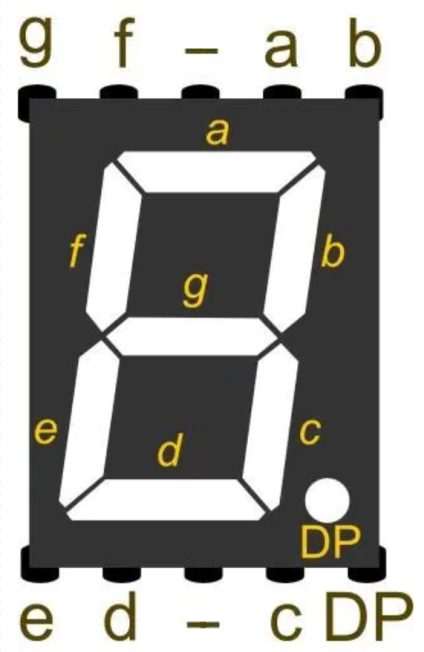

#### 4. Schematic Diagram：

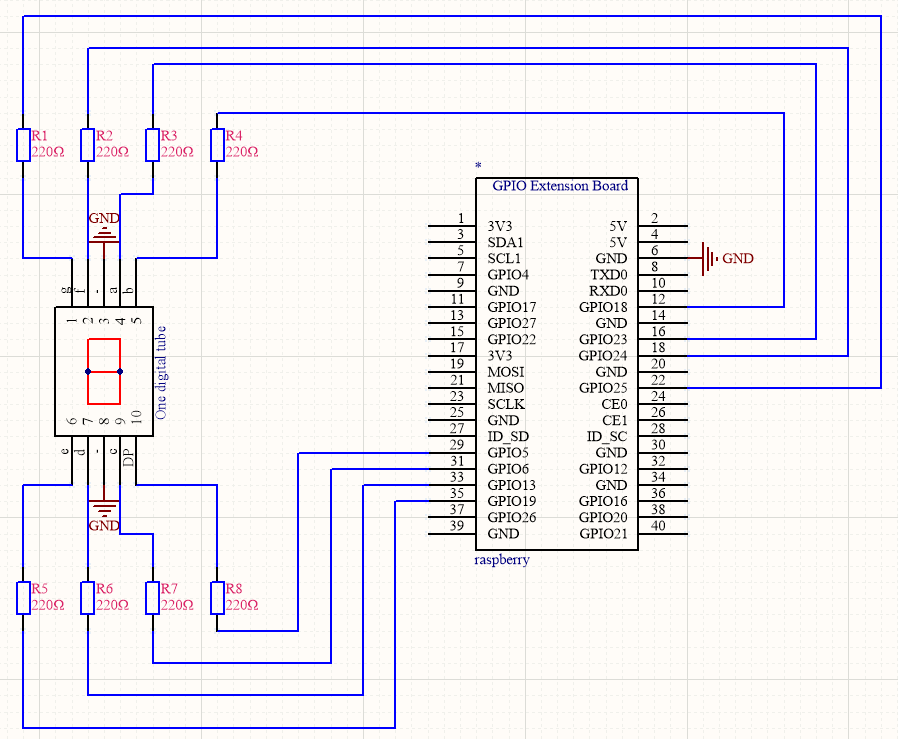

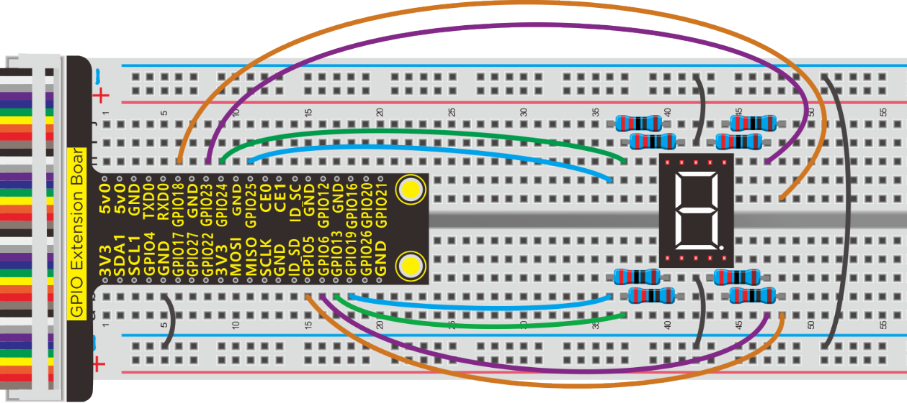

#### 5. Run Example Code：

Input the following commands and press "Enter":

cd /home/pi/pythonCode_A

python 10_one-digital-LED.py

#### 6. Test Results：

LED display shows0\~9，in loop way.

<span style="color: rgb(255, 76, 65);">Note:</span> Press Ctrl + C on keyboard and exit code running.

#### 7. Example Code：

```python
import RPi.GPIO as GPIO
from time import sleep

## led pin
a = 23
b = 18
c = 6
d = 13
e = 19
f = 24
g = 25
dp = 5

GPIO.setmode(GPIO.BCM)  ##use BCM numbers
##set the Pin OUTPUT mode
GPIO.setup(a,GPIO.OUT)  
GPIO.setup(b,GPIO.OUT)  
GPIO.setup(c,GPIO.OUT)  
GPIO.setup(d,GPIO.OUT)  
GPIO.setup(e,GPIO.OUT)  
GPIO.setup(f,GPIO.OUT)  
GPIO.setup(g,GPIO.OUT)  
GPIO.setup(dp,GPIO.OUT)  

## display 0
def d_0():
    GPIO.output(a,GPIO.HIGH)
    GPIO.output(b,GPIO.HIGH)
    GPIO.output(c,GPIO.HIGH)
    GPIO.output(d,GPIO.HIGH)
    GPIO.output(e,GPIO.HIGH)
    GPIO.output(f,GPIO.HIGH)
    GPIO.output(g,GPIO.LOW)
    GPIO.output(dp,GPIO.LOW)
def d_1():  ## display 1
    GPIO.output(a,GPIO.LOW)
    GPIO.output(b,GPIO.HIGH)
    GPIO.output(c,GPIO.HIGH)
    GPIO.output(d,GPIO.LOW)
    GPIO.output(e,GPIO.LOW)
    GPIO.output(f,GPIO.LOW)
    GPIO.output(g,GPIO.LOW)
    GPIO.output(dp,GPIO.LOW)
def d_2():  ## display 2
    GPIO.output(a,GPIO.HIGH)
    GPIO.output(b,GPIO.HIGH)
    GPIO.output(c,GPIO.LOW)
    GPIO.output(d,GPIO.HIGH)
    GPIO.output(e,GPIO.HIGH)
    GPIO.output(f,GPIO.LOW)
    GPIO.output(g,GPIO.HIGH)
    GPIO.output(dp,GPIO.LOW)
def d_3():  ## display 4
    GPIO.output(a,GPIO.HIGH)
    GPIO.output(b,GPIO.HIGH)
    GPIO.output(c,GPIO.HIGH)
    GPIO.output(d,GPIO.HIGH)
    GPIO.output(e,GPIO.LOW)
    GPIO.output(f,GPIO.LOW)
    GPIO.output(g,GPIO.HIGH)
    GPIO.output(dp,GPIO.LOW)
def d_4():
    GPIO.output(a,GPIO.LOW)
    GPIO.output(b,GPIO.HIGH)
    GPIO.output(c,GPIO.HIGH)
    GPIO.output(d,GPIO.LOW)
    GPIO.output(e,GPIO.LOW)
    GPIO.output(f,GPIO.HIGH)
    GPIO.output(g,GPIO.HIGH)
    GPIO.output(dp,GPIO.LOW)
def d_5():
    GPIO.output(a,GPIO.HIGH)
    GPIO.output(b,GPIO.LOW)
    GPIO.output(c,GPIO.HIGH)
    GPIO.output(d,GPIO.HIGH)
    GPIO.output(e,GPIO.LOW)
    GPIO.output(f,GPIO.HIGH)
    GPIO.output(g,GPIO.HIGH)
    GPIO.output(dp,GPIO.LOW)
def d_6():
    GPIO.output(a,GPIO.HIGH)
    GPIO.output(b,GPIO.LOW)
    GPIO.output(c,GPIO.HIGH)
    GPIO.output(d,GPIO.HIGH)
    GPIO.output(e,GPIO.HIGH)
    GPIO.output(f,GPIO.HIGH)
    GPIO.output(g,GPIO.HIGH)
    GPIO.output(dp,GPIO.LOW)
def d_7():
    GPIO.output(a,GPIO.HIGH)
    GPIO.output(b,GPIO.HIGH)
    GPIO.output(c,GPIO.HIGH)
    GPIO.output(d,GPIO.LOW)
    GPIO.output(e,GPIO.LOW)
    GPIO.output(f,GPIO.LOW)
    GPIO.output(g,GPIO.LOW)
    GPIO.output(dp,GPIO.LOW)
def d_8():
    GPIO.output(a,GPIO.HIGH)
    GPIO.output(b,GPIO.HIGH)
    GPIO.output(c,GPIO.HIGH)
    GPIO.output(d,GPIO.HIGH)
    GPIO.output(e,GPIO.HIGH)
    GPIO.output(f,GPIO.HIGH)
    GPIO.output(g,GPIO.HIGH)
    GPIO.output(dp,GPIO.LOW)
def d_9():
    GPIO.output(a,GPIO.HIGH)
    GPIO.output(b,GPIO.HIGH)
    GPIO.output(c,GPIO.HIGH)
    GPIO.output(d,GPIO.HIGH)
    GPIO.output(e,GPIO.LOW)
    GPIO.output(f,GPIO.HIGH)
    GPIO.output(g,GPIO.HIGH)
    GPIO.output(dp,GPIO.LOW)

print("test...")
while True:
    d_0()  ##Call function showing 0
    sleep(1) ##delay 1s
    d_1()
    sleep(1)
    d_2()
    sleep(1)
    d_3()
    sleep(1)
    d_4()
    sleep(1)
    d_5()
    sleep(1)
    d_6()
    sleep(1)
    d_7()
    sleep(1)
    d_8()
    sleep(1)
    d_9()
    sleep(1)

GPIO.cleanup()  ##realese all GPIO
```

### Project 11： 4-Digit Segment LED Display

#### 1. Description：

In previous lesson, the LED display only shows 1 digit number, whereas, we could try to operate 4-digit segment LED display.

#### 2. Components：

|   |  |  |  | |  | |
| ------------------------------------------------------------ | ------------------------------------------------------------ | ------------------------------------------------------------ | ------------------------------------------------------------ | ------------------------------------------------------------ | ------------------------------------------------------------ | ------------------------------------------------------------ |
| Raspberry Pi*1                                               | GPIO Extension Board*1                                       | 40 pin ColorfulJumper Wires*1                                | Breadboard*1                                                 | 4-digit 7-seg LED*1                                          | 220Ω Resistor*8                                              | Jumper Wires                                                 |

#### 3. Component Knowledge:

**4-digit LED display:**

The 4-digit LED display is divided into common anode and common cathode. Similar to 1-digit segment LED display, it is controlled display segment by 8 GPIO ports(8 LED lights). However, this is 4 digit display, 4 GPIO ports are required
to control the bit selection terminal.

Ours is common cathode

4-digit LED Display Pinout

Pin 1, 2, 3 and 4 are control pin of control bit

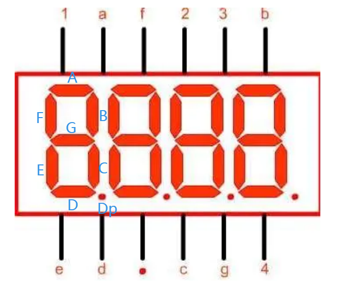

**Schematic Diagram**


#### 4. Schematic Diagram：

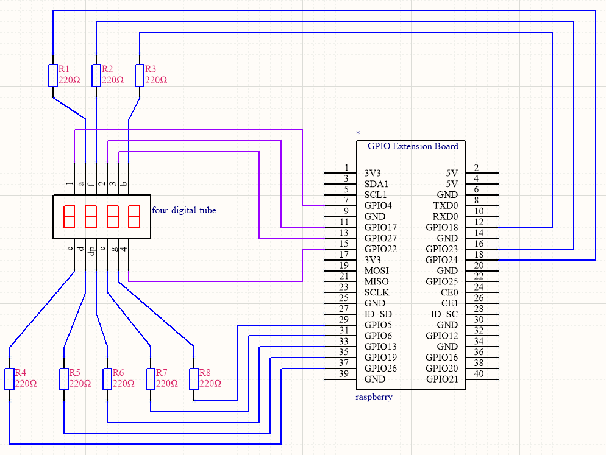


#### 5. Run Example Code：

Input the following commands and press "Enter":

cd /home/pi/pythonCode_A

python 11_four-digital-LED.py

#### 6. Test Results：

4-digit LED display firstly shows“0000”, then plus 1 every time until it
reaches“9999”, however, when “9999” adds 1, the value changes into“0000”.

<span style="color: rgb(255, 76, 65);">Note:</span> Press Ctrl + C on keyboard and exit code running.

#### 7. Example Code：

```python
## -*- coding:utf-8 -*-
import RPi.GPIO as GPIO
from time import sleep
from threading import Timer  ##Library files for introducing timers
 
d_num = 0
b_num = 0
##Pin of each section of nixie tube
a = 24
b = 18
c = 6
d = 19
e = 26
f = 23
g = 5
dp = 13
##Pin of each digit of nixie tube
d1 = 4
d2 = 17
d3 = 27
d4 = 22

GPIO.setmode(GPIO.BCM)
GPIO.setwarnings(False)
##set as output
GPIO.setup(a,GPIO.OUT)  
GPIO.setup(b,GPIO.OUT)  
GPIO.setup(c,GPIO.OUT)  
GPIO.setup(d,GPIO.OUT)  
GPIO.setup(e,GPIO.OUT)  
GPIO.setup(f,GPIO.OUT)  
GPIO.setup(g,GPIO.OUT)  
GPIO.setup(dp,GPIO.OUT)  
##set as output
GPIO.setup(d1,GPIO.OUT)  
GPIO.setup(d2,GPIO.OUT)  
GPIO.setup(d3,GPIO.OUT)  
GPIO.setup(d4,GPIO.OUT)  

##Set to high level, turn off the nixie tube
GPIO.output(d1,GPIO.HIGH)
GPIO.output(d2,GPIO.HIGH)
GPIO.output(d3,GPIO.HIGH)
GPIO.output(d4,GPIO.HIGH)

def d_0():  ##display 0
    GPIO.output(a,GPIO.HIGH)
    GPIO.output(b,GPIO.HIGH)
    GPIO.output(c,GPIO.HIGH)
    GPIO.output(d,GPIO.HIGH)
    GPIO.output(e,GPIO.HIGH)
    GPIO.output(f,GPIO.HIGH)
    GPIO.output(g,GPIO.LOW)
    GPIO.output(dp,GPIO.LOW)
def d_1(): ##display 1
    GPIO.output(a,GPIO.LOW)
    GPIO.output(b,GPIO.HIGH)
    GPIO.output(c,GPIO.HIGH)
    GPIO.output(d,GPIO.LOW)
    GPIO.output(e,GPIO.LOW)
    GPIO.output(f,GPIO.LOW)
    GPIO.output(g,GPIO.LOW)
    GPIO.output(dp,GPIO.LOW)
def d_2(): ##display 2
    GPIO.output(a,GPIO.HIGH)
    GPIO.output(b,GPIO.HIGH)
    GPIO.output(c,GPIO.LOW)
    GPIO.output(d,GPIO.HIGH)
    GPIO.output(e,GPIO.HIGH)
    GPIO.output(f,GPIO.LOW)
    GPIO.output(g,GPIO.HIGH)
    GPIO.output(dp,GPIO.LOW)
def d_3():
    GPIO.output(a,GPIO.HIGH)
    GPIO.output(b,GPIO.HIGH)
    GPIO.output(c,GPIO.HIGH)
    GPIO.output(d,GPIO.HIGH)
    GPIO.output(e,GPIO.LOW)
    GPIO.output(f,GPIO.LOW)
    GPIO.output(g,GPIO.HIGH)
    GPIO.output(dp,GPIO.LOW)
def d_4():
    GPIO.output(a,GPIO.LOW)
    GPIO.output(b,GPIO.HIGH)
    GPIO.output(c,GPIO.HIGH)
    GPIO.output(d,GPIO.LOW)
    GPIO.output(e,GPIO.LOW)
    GPIO.output(f,GPIO.HIGH)
    GPIO.output(g,GPIO.HIGH)
    GPIO.output(dp,GPIO.LOW)
def d_5():
    GPIO.output(a,GPIO.HIGH)
    GPIO.output(b,GPIO.LOW)
    GPIO.output(c,GPIO.HIGH)
    GPIO.output(d,GPIO.HIGH)
    GPIO.output(e,GPIO.LOW)
    GPIO.output(f,GPIO.HIGH)
    GPIO.output(g,GPIO.HIGH)
    GPIO.output(dp,GPIO.LOW)
def d_6():
    GPIO.output(a,GPIO.HIGH)
    GPIO.output(b,GPIO.LOW)
    GPIO.output(c,GPIO.HIGH)
    GPIO.output(d,GPIO.HIGH)
    GPIO.output(e,GPIO.HIGH)
    GPIO.output(f,GPIO.HIGH)
    GPIO.output(g,GPIO.HIGH)
    GPIO.output(dp,GPIO.LOW)
def d_7():
    GPIO.output(a,GPIO.HIGH)
    GPIO.output(b,GPIO.HIGH)
    GPIO.output(c,GPIO.HIGH)
    GPIO.output(d,GPIO.LOW)
    GPIO.output(e,GPIO.LOW)
    GPIO.output(f,GPIO.LOW)
    GPIO.output(g,GPIO.LOW)
    GPIO.output(dp,GPIO.LOW)
def d_8():
    GPIO.output(a,GPIO.HIGH)
    GPIO.output(b,GPIO.HIGH)
    GPIO.output(c,GPIO.HIGH)
    GPIO.output(d,GPIO.HIGH)
    GPIO.output(e,GPIO.HIGH)
    GPIO.output(f,GPIO.HIGH)
    GPIO.output(g,GPIO.HIGH)
    GPIO.output(dp,GPIO.LOW)
def d_9():
    GPIO.output(a,GPIO.HIGH)
    GPIO.output(b,GPIO.HIGH)
    GPIO.output(c,GPIO.HIGH)
    GPIO.output(d,GPIO.HIGH)
    GPIO.output(e,GPIO.LOW)
    GPIO.output(f,GPIO.HIGH)
    GPIO.output(g,GPIO.HIGH)
    GPIO.output(dp,GPIO.LOW)

def b_show(bit):   ##Choose which digital tube to turn on
    ##Choose to activate the single-digit digital tube, 
    ##which is the right-most digit of the 4-digit digital tube
    if(bit == 0):
        GPIO.output(d1,GPIO.LOW)
        GPIO.output(d2,GPIO.HIGH)
        GPIO.output(d3,GPIO.HIGH)
        GPIO.output(d4,GPIO.HIGH)
    if(bit == 1):   ##Select the start digit digital tube
        GPIO.output(d1,GPIO.HIGH)
        GPIO.output(d2,GPIO.LOW)
        GPIO.output(d3,GPIO.HIGH)
        GPIO.output(d4,GPIO.HIGH)
    if(bit == 2):   ##Select the digital tube that activates the hundreds digit number
        GPIO.output(d1,GPIO.HIGH)
        GPIO.output(d2,GPIO.HIGH)
        GPIO.output(d3,GPIO.LOW)
        GPIO.output(d4,GPIO.HIGH)
    if(bit == 3):   ##Select the digital tube to activate thousands of digits
        GPIO.output(d1,GPIO.HIGH)
        GPIO.output(d2,GPIO.HIGH)
        GPIO.output(d3,GPIO.HIGH)
        GPIO.output(d4,GPIO.LOW)

def recongnition(num):
    if(num == 0):  ##num = 0
        d_0()      ##Call d_0() to display 0 on the digital tube
    if(num == 1):
        d_1()
    if(num == 2):
        d_2()
    if(num == 3):
        d_3()
    if(num == 4):
        d_4()
    if(num == 5):
        d_5()
    if(num == 6):
        d_6()
    if(num == 7):
        d_7()
    if(num == 8):
        d_8()
    if(num == 9):
        d_9()
        
def display():
    global b_num
    if(b_num == 0):  ##The ones place, the one on the far right of the 4-digit digital tube
        ge = d_num%10 ## So % is the cooperations, so for example, 1356%10 = 6, so you get the units digit of 1356
        recongnition(ge) ##This function, called recongnition(), is the number displayed around the digital tube, at d_num=1356, which is 6
        b_show(0)  ##Call the function b_show(), which controls the nibbit, so that the units digit is the rightmost digit that can be lit
    if(b_num == 1):  ##ten
        shi = d_num%100 ##I'm going to subtract the hundreds place，1356 % 100 = 56
        shi = shi/10  ## 56 / 10 = 5 ，You get ten digits
        recongnition(shi)
        b_show(1)  ##Enable the ten digit digital tube to be lit
    if(b_num == 2): ##A one hundred - bit
        bai = d_num%1000  ##Let's leave out the thousands first, for example：1356 % 1000 = 356 ，So we get rid of the 1
        bai = bai/100     ##Then,356 / 100 = 3，The integers are equal to 3, so you get the hundreds
        recongnition(bai)
        b_show(2)  ##So that the hundreds digit digital tube can be lit
    if(b_num == 3): ##A one thousand - bit
        qian = d_num/1000 ## 1356 / 1000 = 1 ，We get thousands
        recongnition(qian)
        b_show(3)  ##So that the digital tube in the thousands can be lit
    b_num = b_num + 1  ##b_num add 1，In order to show you all the numbers
    if(b_num >3): ##Since the digital tube is four bits, the limit cannot be greater than three
        b_num = 0 ##Greater than 3 is equal to 0
    t = Timer(timer_interval,display) ##
    t.start()

timer_interval = 0.005   ##Start the timer interrupt every 0.005 seconds
t = Timer(timer_interval,display)  ##Timer() is the Timer function, which means display is executed every 0.005s
t.start() ##On timer

print("test...")
while True:
    for num in range(0,10000):  ##display 0~10000
        d_num = num  ##num = d_num
        print(d_num) ##Terminal print out : d_num
        sleep(1)  ##delay 1s

GPIO.cleanup() ##release all GPIO
```
#### 8. Explanation：

| from threading import Timer                                                   | Import Timer from“threading” start() enables“Timer”, cancel() means stopping“Timer”                                                                                         |
|-------------------------------------------------------------------------------|-----------------------------------------------------------------------------------------------------------------------------------------------------------------------------|
| t = Timer(timer_interval,display)                                             | This is a timer“t”，timer_interval is the time interval of triggering timer function, for instance, timer_interval = 0.005，that means trigger”display”function each 0.005s |
|  threading module library: [https://docs.python.org/3/library/threading.html](https://docs.python.org/3/library/threading.html)|                                                                                                                                                                             |

### Project 12：8*8 Dot Matrix

#### 1. Description：

In this chapter, let’s get down with a 8x8 LED dot matrix.

#### 2. Components：

|  |  |  |  | |  |  |
| ------------------------------------------------------------ | ------------------------------------------------------------ | ------------------------------------------------------------ | ------------------------------------------------------------ | ------------------------------------------------------------ | ------------------------------------------------------------ | ------------------------------------------------------------ |
| Raspberry Pi*1                                               | GPIO Extension Board*1                                       | 40 pin Colorful Jumper Wires*1                               | Breadboard*1                                                 | 8\*8 LED Matrix*1                                             | Resistor*8                                            | Jumper Wires                                                 |

#### 3. Component Knowledge:

**8\*8 LED Matrix：**

8×8 matrix consists of 64 dots or pixels. There is a LED for each pixel and these LEDs are connected to total of 16 pins.

Generally, there are two types of dot matrix – common cathode and common anode.


Pic 1


Pic 2

#### 4. Schematic Diagram：


#### 5. Working Principle：

8\*8 is composed of LEDs. It will turn on if the positive is high level and negative is low level.

For the above figure, the first LED will be on if setting Y0(0) to HIGH and the rest of pins to LOW, X0(A) to LOW and the rest one to HIGH.

#### 6. Run Example Code：

Input the following commands and press "Enter":

cd /home/pi/pythonCode_A

python 12_Matrix-LED.py

#### 7. Test Results：

The dot on 8\*8 dot matrix module gradually turns on until to full screen and then off.

<span style="color: rgb(255, 76, 65);">Note:</span> Press Ctrl + C on keyboard and exit code running.

#### 8. Example Code：

```python
## -*- coding:utf-8 -*-
import RPi.GPIO as GPIO
from time import sleep

GPIO.setmode(GPIO.BCM)
GPIO.setwarnings(False)

##Define the pin of the row
row1 = 27
row2 = 4
row3 = 5
row4 = 17
row5 = 26
row6 = 6
row7 = 19
row8 = 13
##Define the pins of the column
col1 = 24
col2 = 16
col3 = 20
col4 = 18
col5 = 21
col6 = 23
col7 = 25
col8 = 12

##Set to output
GPIO.setup(row1,GPIO.OUT)
GPIO.setup(row2,GPIO.OUT)
GPIO.setup(row3,GPIO.OUT)
GPIO.setup(row4,GPIO.OUT)
GPIO.setup(row5,GPIO.OUT)
GPIO.setup(row6,GPIO.OUT)
GPIO.setup(row7,GPIO.OUT)
GPIO.setup(row8,GPIO.OUT)

GPIO.setup(col1,GPIO.OUT)
GPIO.setup(col2,GPIO.OUT)
GPIO.setup(col3,GPIO.OUT)
GPIO.setup(col4,GPIO.OUT)
GPIO.setup(col5,GPIO.OUT)
GPIO.setup(col6,GPIO.OUT)
GPIO.setup(col7,GPIO.OUT)
GPIO.setup(col8,GPIO.OUT)

##Sets the pin of the column to low level
GPIO.output(col1,GPIO.LOW)
GPIO.output(col2,GPIO.LOW)
GPIO.output(col3,GPIO.LOW)
GPIO.output(col4,GPIO.LOW)
GPIO.output(col5,GPIO.LOW)
GPIO.output(col6,GPIO.LOW)
GPIO.output(col7,GPIO.LOW)
GPIO.output(col8,GPIO.LOW)

##Since the column of the lattice has been set to low level, 
##the corresponding row of the lattice will light up when the pin of the row is at high level
def Row(d):
    if(d ==1):
        GPIO.output(row1,GPIO.HIGH)  ##Light the first line
    if(d ==2):
        GPIO.output(row2,GPIO.HIGH)  ##Light the second line
    if(d ==3):
        GPIO.output(row3,GPIO.HIGH)
    if(d ==4):
        GPIO.output(row4,GPIO.HIGH)
    if(d ==5):
        GPIO.output(row5,GPIO.HIGH)
    if(d ==6):
        GPIO.output(row6,GPIO.HIGH)
    if(d ==7):
        GPIO.output(row7,GPIO.HIGH)
    if(d ==8):
        GPIO.output(row8,GPIO.HIGH)
    
##Close the lattice
def off(): 
    GPIO.output(row1,GPIO.LOW)
    GPIO.output(row2,GPIO.LOW)
    GPIO.output(row3,GPIO.LOW)
    GPIO.output(row4,GPIO.LOW)
    GPIO.output(row5,GPIO.LOW)
    GPIO.output(row6,GPIO.LOW)
    GPIO.output(row7,GPIO.LOW)
    GPIO.output(row8,GPIO.LOW)

print("test...")
while True:
    for num in range(1,10):  ##Light the lattice line by line
        Row(num)
        if(num == 9):  ##Because the lattice has only 8 rows, and I'm limiting it here, is equal to 9
            off()      ##Close the lattice
        sleep(0.2)

GPIO.cleanup()  ##Release all GPIO ports
```

### Project 13： 74HC595

#### 1. Description：

In previous lesson, we control a 1-digit LED display with eight, which is wasteful. We need to figure out a method to save the use of GPIO ports. In fact, we need a 74HC595 CHIP.

#### 2. Components：

|  |  |  |  |
| ------------------------------------------------------------ | ------------------------------------------------------------ | ------------------------------------------------------------ | ------------------------------------------------------------ | 
| Raspberry Pi*1                                               | GPIO Extension Board*1                                       | 40 pin Colorful Jumper Wires*1                               | Breadboard*1                                                 |
| | 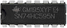| |                                                               |                                                             
| 220Ω Resistor*8                                              | 74HC595N*1                                                   | Jumper Wires                                                 |                                      1-digit 7- seg LED*1                        |                                                              

#### 3. Component Knowledge:

**74HC595**：

The 74HC595 consists of an 8−bit shift register and an 8−bit D−typelatch with three−state parallel outputs. The shift register accepts serial data and provides a serial output. The shift register also provides parallel data to the 8−bit latch. The shift register and latch have independent clock inputs. This device also has an asynchronous reset for the shift register.


**74HC595 Control Protocol:**

| 13 PIN OE   | Enable pin, not controlled by program when high level; make it connect to GND when low level                                                            |
|-------------|---------------------------------------------------------------------------------------------------------------------------------------------------------|
| 14 PIN SI   | This is pin receiving data, enter a bit each time and compose a byte if inputting eight times                                                           |
| 10 PIN SCLK | Shift register clear pin, used to clear out all data in shift register, when low level, data will be cleared out.                                       |
| 11 PIN SCK  | Clock pin of shift register, the data inside will move backward and receive the data input when it is on rising edge.                                   |
| 12 PIN RCK  | Clock input pin of latch register, data from shift register will saved in latch register when it is on rising edge. The data will be output from QA\~QH |
| 9 Pin SQH   | Cascade pin，connected to multiple 74HC595 chips                                                                                                        |

More details about 74HC595 chip, you could look through chip specification folder

#### 4. Schematic Diagram：

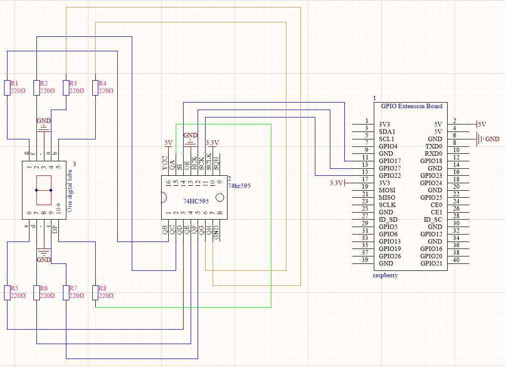


The output end QA\~QH of 74HC595 respond to the pin DP, and g\~a.

Why? Since the binary is counted from the right, programming will be convenient. For example, 1-digit display shows 0011 1111 , the first bit is 1 which equals to QA saved in 74HC595, then when the rest numbers are sent to 74HC595, 1 will be pushed to QH, and last bit 0 is placed on QA. However, the wiring is so inverse that the first bit of binary corresponds to a and last one to DIP controlling 1-digit display.

| 74HC595 |    |    |    |    |    |    |    |    |         |
|---------|----|----|----|----|----|----|----|----|---------|
|         | QH | QG | QF | QE | QD | QC | QB | QA |         |
|         | a  | b  | c  | d  | e  | f  | g  | dp |         |
| **0**   | 1  | 1  | 1  | 1  | 1  | 1  | 0  | 0  | **252** |
| **1**   | 0  | 1  | 1  | 0  | 0  | 0  | 0  | 0  | **96**  |
| **2**   | 1  | 1  | 0  | 1  | 1  | 0  | 1  | 0  | **218** |
| **3**   | 1  | 1  | 1  | 1  | 0  | 0  | 1  | 0  | **242** |
| **4**   | 0  | 1  | 1  | 0  | 0  | 1  | 1  | 0  | **102** |
| **5**   | 1  | 0  | 1  | 1  | 0  | 1  | 1  | 0  | **182** |
| **6**   | 1  | 0  | 1  | 1  | 1  | 1  | 1  | 0  | **190** |
| **7**   | 1  | 1  | 1  | 0  | 0  | 0  | 0  | 0  | **224** |
| **8**   | 1  | 1  | 1  | 1  | 1  | 1  | 1  | 0  | **254** |
| **9**   | 1  | 1  | 1  | 1  | 0  | 1  | 1  | 0  | **246** |

#### 5. Run Example Code：

Input the following commands and press "Enter":

cd /home/pi/pythonCode_A

python 13_74HC595.py

#### 6. Test Results：

1-digit seven segment display shows 0\~9.

<span style="color: rgb(255, 76, 65);">Note:</span> Press Ctrl + C on keyboard and exit code running.

#### 7. Example Code：

```python
import RPi.GPIO as GPIO
from time import sleep

##define 74Hc595 pin
data = 17  ##Serial digital input pin
rck = 27
sck = 22

##These hexadecimal numbers show data from 0 to 9
##Hexadecimal to binary,0x3F, 0011 1111
num = [0x3F, 0x06, 0x5B, 0x4F, 0x66, 0x6D, \
       0x7D, 0x07, 0x7F, 0x6F]

GPIO.setmode(GPIO.BCM)   ##use BCM numbers
##set the 74HC595 Pin OUTPUT mode
GPIO.setup(data,GPIO.OUT)  
GPIO.setup(rck,GPIO.OUT)  
GPIO.setup(sck,GPIO.OUT)
##Set rck and sck to high first
GPIO.output(rck,GPIO.HIGH)
GPIO.output(sck,GPIO.HIGH)

def bitshift(dat):
    if dat == 0:
        da = num[0]
    if dat == 1:
        da = num[1]
    if dat == 2:
        da = num[2]
    if dat == 3:
        da = num[3]
    if dat == 4:
        da = num[4]
    if dat == 5:
        da = num[5]
    if dat == 6:
        da = num[6]
    if dat == 7:
        da = num[7]
    if dat == 8:
        da = num[8]
    if dat == 9:
        da = num[9]
    for a in range(0,8):
        GPIO.output(sck,GPIO.LOW)  ##set sckPin LOW 
        if (da & 0x01) == 0x01:    ##Judge whether the last bit is 1
            GPIO.output(data,GPIO.HIGH)  ##1
        else:
            GPIO.output(data,GPIO.LOW)   ##0
            ##set sckPin HIGH , Move data to shift register
        GPIO.output(sck,GPIO.HIGH)
        ##Move data one bit to the right
        da =da  >> 1

def display(num):
    ##Clock pin of storage register is set to low level
    GPIO.output(rck,GPIO.LOW)
    ##function, receive data
    bitshift(num)
    ##Clock pin of storage register is set to high level
    ##At this time, the data will be output from the Q0 ~ Q7 port
    GPIO.output(rck,GPIO.HIGH)

print("test...")
while True:
    for a in range(0,10):  ##display 0~9
        display(a)
        sleep(1)
        
GPIO.cleanup()
```

### Project 14： Button-controlled LED


#### 1. Description：

Usually, a complete open loop control is made of external information input and controller and actuator.

The external information is input into controller which can analyze the input data and send to control signals to make actuator to react.

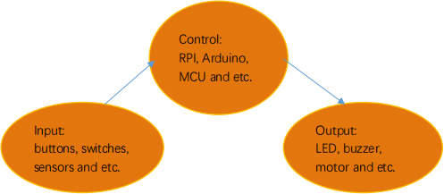

A button-controlled LED is decided by an open loop control. Next, we will make a desk lamp with a button, an LED and RPi. LED is on when button is pressed, on the contrary, it will be off.

#### 2. Components：

|  |  |  |  |  |
| ------------------------------------------------------------ | ------------------------------------------------------------ | ------------------------------------------------------------ | ------------------------------------------------------------ | ------------------------------------------------------------ |
| Raspberry Pi*1                                               | GPIO Extension Board*1                                       | 40 pin Colorful Jumper Wires*1                               | Breadboard*1                                                 | LED - Red *1                                                 |
|   |   |   |  |                                                              |
| 220Ω Resistor*1                                              | Jumper Wires                                                 | 10KΩ Resistor*1                                              | Button Switch *1                                             |                                                              |

#### 3. Schematic Diagram：


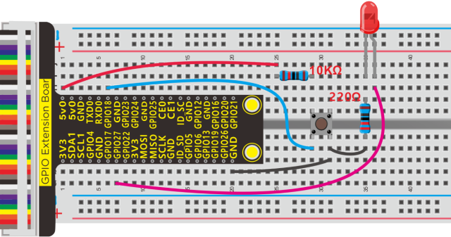

#### 4. Eliminate Button Shaking

The LED status won’t jump into new state immediately when button is pressed. There will be a short continuous shaking before into new status, which is similar with release status.


Therefore, there will be many a presses and release actions. The shaking will misleads the high speed movement of MCU, causing wrong judgement. That requires that we need to judge the button’ status frequently.

The button means being pressed when its status is stable.

#### 5. Run Example Code：

Input the following commands and press "Enter":

cd /home/pi/pythonCode_A

python 14_button_led.py

#### 6. Test Results：

Press button, LED turns on, press again, LED is off.

<span style="color: rgb(255, 76, 65);">Note:</span> Press Ctrl + C on keyboard and exit code running.

#### 7. Example Code：

```python
import RPi.GPIO as GPIO
from time import sleep

LED = 27  ##set ledPin
button = 18 ##set buttonPin
val = 0 ##Button variables
count = 0 ##Record the number of button presses
flag = 0 ##Odd even variable
GPIO.setmode(GPIO.BCM)  ## use BCM numbers

GPIO.setup(LED,GPIO.OUT)   ##set the ledPin OUTPUT mode
GPIO.setup(button,GPIO.IN,GPIO.PUD_UP) ##set the buttonPin INPUT mode and buttonPin to PULL UP

while True:
    val = GPIO.input(button)  ##Receive button value
    ##print("button = %d"%(val))
    if(val == 0):   ##if button is pressed
        sleep(0.01) ##Eliminate button jitter
        val = GPIO.input(button)  ##Receive button value
        if(val == 1):  ##Loosen the button
            count = count + 1  ##Count the number of clicks on the button
            print("count = %d" %count)
    
    flag = count % 2  ##Remainder 2 ,Even is 0, odd is 1
    if(flag == 1):
        GPIO.output(LED,GPIO.HIGH)  ##turn on led
    else:
        GPIO.output(LED,GPIO.LOW)  ##turn off led
        
GPIO.cleanup() ##release all GPIO
```


### Project 15： Responder

#### 1. Description：

A responder is someone who answers a question or who acts quickly in response to some event. In this lesson, we will show you how to make a responder and introduce its working principle.

#### 2. Components：

|  |  |        |  |  |  |
| ------------------------ | ------------------------ | ------------------------------ | ------------------------ | ------------------------ | ------------------------ |
| Raspberry Pi*1           | GPIO Extension Board*1   | 40 pin Colorful Jumper Wires*1 | Breadboard*1             | LED - Red *1             | LED - Green*1            |
|  |  |        |  |  |                          |
| LED - Yellow*1           | 220Ω Resistor*3          | Jumper Wires                   | 10KΩ Resistor*4          | Button Switch *4         |                          |

#### 3. Schematic Diagram：

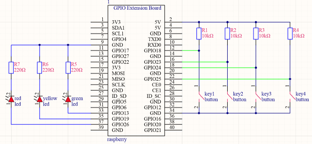


#### 4. Design Description：

You could assume a scene that three competitors in knowledge quiz.

Everyone has a responder and an LED. Corresponding LED will turn on if one presses his own responder, however, others’ won’t be on. What’s more, a questioner has a button to control their LEDs. After a round of game, LEDs are off, the quiz restarts.

#### 5. Run Example Code：

Input the following commands and press "Enter":

cd /home/pi/pythonCode_A

python 15_Responder.py

#### 6. Test Results：

The corresponding LED will turn on if a competitor press his own responder, but others’ are off. The questioner press a button to turn off their LEDs and restart a new round quiz.

<span style="color: rgb(255, 76, 65);">Note:</span> Press Ctrl + C on keyboard and exit code running.

#### 7. Example Code：

```python
import RPi.GPIO as GPIO
from time import sleep

## led colour
red = 26 
yellow = 19
blue = 13

##set button pin
##Player's button
key1 = 23
key2 = 24
key3 = 25
##Button for the author
reset = 18  
flag = True  ##One sign quantity for restriction, only one light can be on

GPIO.setmode(GPIO.BCM) ##use BCM numbers
##set the led Pin OUTPUT mode
GPIO.setup(red,GPIO.OUT)  
GPIO.setup(yellow,GPIO.OUT)  
GPIO.setup(blue,GPIO.OUT)
##set the button pin INPUT mode and PUD_UP
GPIO.setup(key1,GPIO.IN,GPIO.PUD_UP)  
GPIO.setup(key2,GPIO.IN,GPIO.PUD_UP)  
GPIO.setup(key3,GPIO.IN,GPIO.PUD_UP)  
GPIO.setup(reset,GPIO.IN,GPIO.PUD_UP)  

while True:  ##loop
    if not GPIO.input(key1) and flag == True:  ##Judge if player 1's button is pressed
        GPIO.output(red,GPIO.HIGH)
        flag = False
    if not GPIO.input(key2) and flag == True:  ##Judge if player 2's button is pressed
        GPIO.output(yellow,GPIO.HIGH)
        flag = False
    if not GPIO.input(key3) and flag == True:  ##Judge if player 3's button is pressed
        GPIO.output(blue,GPIO.HIGH)
        flag = False
    if not GPIO.input(reset):  ##The writer's button is pressed
        GPIO.output(red,GPIO.LOW)
        GPIO.output(yellow,GPIO.LOW)
        GPIO.output(blue,GPIO.LOW)
        flag = True

GPIO.cleanup()  ##release all GPIO
```

### Project 16： PIR Motion Sensor

#### 1. Description：

In this lesson, we will learn about PIR motion sensor.

#### 2. Components：

|  |  |        |  | 
| ------------------------------------------------------------ | ------------------------------------------------------------ | ------------------------------------------------------------ | ------------------------------------------------------------ | 
| Raspberry Pi*1                                               | GPIO Extension Board*1                                       | 40 pin Colorful Jumper Wires*1                               | Breadboard*1                                                 |
|  | 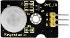 |  |                                                               |                                                            
| 220Ω Resistor*1                                              | PIR Motion Sensor*1                                          | Jumper Wires                                                 |                                                           LED - Red *1    |                                                            

#### 3. Component Knowledge

**PIR Motion Sensor：**

The principle of human infrared sensor is that when certain crystals, such as lithium tantalate and triglyceride sulfate, are heated, the two ends of the crystal will generate an equal number of charges, with opposite signs, which can be converted into voltage output by an amplifier.

Human body will emit IR ray, although weak but can be detected. Sensor will output high level(1) when human being is detected by sensor, otherwise, it will output low level o.

Note: Nothing but moving person can be detected, with the detection distance is up to 3m.

#### 4. Schematic Diagram：


#### 5. Run Example Code：

Input the following commands and press "Enter":

cd /home/pi/pythonCode_A

python 16_PIR-led.py

#### 6. Test Results：

LED will turn on and terminal prints somebody if PIR motion sensor detects people; if not, LED will be off and terminal will print nobody.

<span style="color: rgb(255, 76, 65);">Note: </span>Press Ctrl + C on keyboard and exit code running.

#### 7. Example Code:

```python
import RPi.GPIO as GPIO
import time

GPIO.setmode(GPIO.BCM)
GPIO.setwarnings(False)

ledPin = 5  ##set led pin
pirPin = 18  ##set PYE-IR pin
GPIO.setup(ledPin,GPIO.OUT)
GPIO.setup(pirPin,GPIO.IN)
 

while True:                     ###loop 
    if GPIO.input(pirPin):    ##When someone is detected
        GPIO.output(ledPin,GPIO.HIGH)  ##turn on the led
        print("somebody")
    else:
        GPIO.output(ledPin,GPIO.LOW)  ##turn off led
        print("nobody")
    
GPIO.cleanup()
```

### Project 17： Fire Alarm

#### 1. Description：

A flame detector is a sensor designed to detect and respond to the presence of a flame or fire, allowing flame detection.

#### 2. Components：

|   |  |  |  | 
| ------------------------------------------------------------ | ------------------------------------------------------------ | ------------------------------------------------------------ | ------------------------------------------------------------ | 
| Raspberry Pi*1                                               | GPIO Extension Board*1                                       | 40 pin Colorful Jumper Wires*1    | Breadboard*1                                                 |
|  |  | |            |                                            
| Flame Sensor *1                                              | 10KΩ Resistor*1                                              | Jumper Wires                                                 |                                                           Active Buzzer *1     | 

#### 3. Component Knowledge

**Flame Sensor：**

Flame sensor is made based on the principle that infrared ray is highly sensitive to flame. It has an infrared receiving tube specially designed to detect fire, and then convert the flame brightness to fluctuating level signal. The signals are then input into the central processor and be dealt with accordingly.

Flame sensor is used to detect fire source with wavelength in 760nm～1100nm, detection angle is 60°. When its IR waves length is close to 940nm, and its sensitivity is highest.

Notice that keep flame sensor away from fire source to defend its damage for its working temperature is between -25°-85°

#### 4. Schematic Diagram：

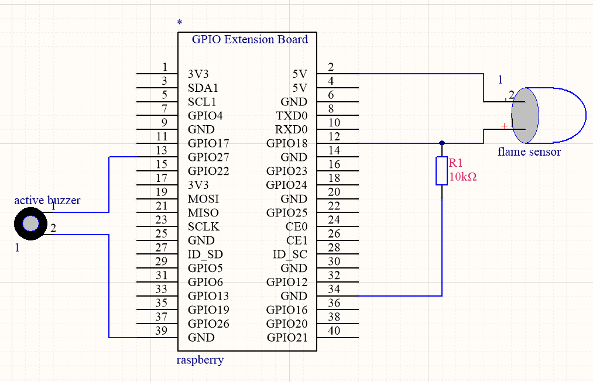

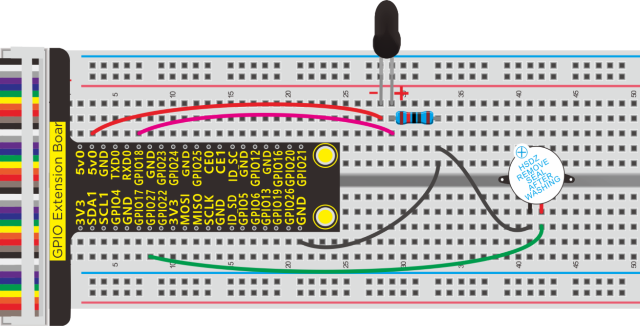

#### 5. Run Example Code：

Input the following commands and press "Enter":

cd /home/pi/pythonCode_A

python 17_flame_buzzer.py

#### 6. Test Results：

Buzzer will alarm when detecting fire, otherwise, it will stop emitting sound.

<span style="color: rgb(255, 76, 65);">Note:</span> Press Ctrl + C on keyboard and exit code running.

#### 7. Example Code：

```python
import RPi.GPIO as GPIO
from time import sleep

##define buzzer pin
buzPin = 27
##define flame Pin
flamePin = 18

val = 0  ##

GPIO.setmode(GPIO.BCM) ##use BCM numbers
GPIO.setup(buzPin,GPIO.OUT)  ##set the buzPin OUTPUT
GPIO.setup(flamePin,GPIO.IN,GPIO.PUD_UP) ##set the flamePin INPUT

while True:
    val = GPIO.input(flamePin) ##Receives the value of the flame sensor
    print("val = %d" %val)
    if (val == 1):  ##When flame is detected
        GPIO.output(buzPin,GPIO.HIGH)  ##Buzzer turn on
    else:
        GPIO.output(buzPin,GPIO.LOW)   ##buzzer turn off
        
GPIO.cleanup() ## Release all GPIO
```

### Project 18： Electronic Hourglass

#### 1. Description：

An hourglass (or sandglass, sand timer, sand clock or egg timer) is a device used to measure the passage of time. It comprises two glass bulbs connected vertically by a narrow neck that allows a regulated flow of a substance (historically sand) from the upper bulb to the lower one. Typically the upper and lower bulbs are symmetric so that the hourglass will measure the same
duration regardless of orientation. The specific duration of time a given hourglass measures is determined by factors including the quantity and coarseness of the particulate matter, the bulb size, and the neck width.

#### 2. Components：

|  |  |  |  |  |
| ------------------------------------------------------------ | ------------------------------------------------------------ | ------------------------------------------------------------ | ------------------------------------------------------------ | ------------------------------------------------------------ |
| Raspberry Pi*1                                               | GPIO Extension Board*1                                       | 40 pin Colorful Jumper Wires*1                               | Breadboard*1                                                 | LED - Red *2                                                 |
|  |  |   | |                                                              |
| 220Ω Resistor*2                                              | Ball Tilt Sensor*1                                           | 10KΩ Resistor*1                                              | Jumper Wires                                                 |                                                              |

#### 3. Component Knowledge

**Ball Tilt Sensor**：

Tilt sensors (tilt ball switch) allow you to detect orientation or inclination. They are small, inexpensive, low-power and easy-to-use. If used properly, they will not wear out.

The tilt-switch twig is the equivalent of a button, and is used as a digital input. Inside the tilt switch is a ball that make contact with the pins when the case is upright. Tilt the case over and the balls don't touch, thus not making a connection. When the switch is level it is open, and when tilted, the switch closes.

It can be used for orientation detection, alarm device or others.

Here is the principle of tilt sensor to illustrate how it works:


#### 4. Schematic Diagram：


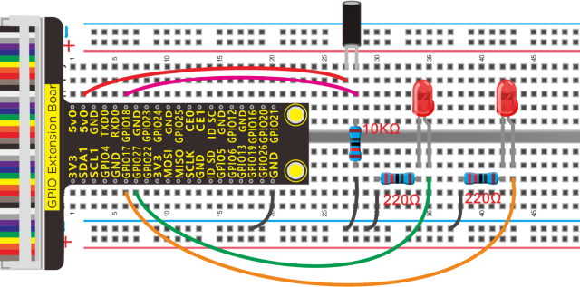

#### 5. Run Example Code：

Input the following commands and press "Enter":

cd /home/pi/pythonCode_A

python 18_ball_Tilt.py

#### 6. Test Results：

Led1 gradually brightens and led2 gradually darkens when place electronic
hourglass, however, as you make it upside down, led1 gradually darkens, led2
gets bright.

<span style="color: rgb(255, 76, 65);">Note: </span>Press Ctrl + C on keyboard and exit code running.

#### 7. Example Code：

```python
import RPi.GPIO as GPIO
from time import sleep

##define led pin
led1Pin = 17
led2Pin = 27
##define Ball Tilt Sensor Pin
tiltPin = 18


GPIO.setmode(GPIO.BCM) ##use BCM unmbers
GPIO.setup(led1Pin,GPIO.OUT)  ##set the ledPin OUTPUT mode
GPIO.setup(led2Pin,GPIO.OUT)
GPIO.output(led1Pin,GPIO.HIGH)  ## make ledPin output HIGH level
GPIO.output(led2Pin,GPIO.LOW)  ## make ledPin output LOW level
GPIO.setup(tiltPin,GPIO.IN,GPIO.PUD_UP)
pwm1 = GPIO.PWM(led1Pin,1000)  ##create a pwm1 instance
pwm1.start(0)  ##start pwm1
pwm2 = GPIO.PWM(led2Pin,1000)  ##create a pwm2 instance
pwm2.start(0)  ##start pwm2
val1 = 50
val2 = 50

while True:
    if not GPIO.input(tiltPin):
        val1 = val1 + 1
        val2 = val2 - 1
        if (val1 >= 100):  ##Limit PWM value to no more than 100
            val1 = 100
        if (val2 < 0):    ##Limit PWM value not less than 0
            val2 = 0
        print("led1 = %1.0f" %(val1))
        pwm1.ChangeDutyCycle(val1)  ##change the frequency
        pwm2.ChangeDutyCycle(val2)
        sleep(0.1)
    else:
        val1 = val1 - 1
        val2 = val2 + 1
        if (val1 < 0):
            val1 = 0
        if (val2 >= 100):
            val2 = 100
        print("led2 = %1.0f" %(val2))
        pwm1.ChangeDutyCycle(val1)
        pwm2.ChangeDutyCycle(val2)
        sleep(0.1)
        
pwm1.stop()  ##stop pwm1

GPIO.cleanup()    ##release all GPIO
```

### Project 19： Stepless Dimming

#### 1. Description：

A stepless dimming control method of a lighting system is applicable to the situations where a light source for a lighting terminal is a fluorescent lamp and/or an LED lamp.

#### 2. Components：

|  |  |  | |
| ------------------------------------------------------------ | ------------------------------------------------------------ | ------------------------------------------------------------ | ------------------------------------------------------------ | 
| Raspberry Pi*1                                               | GPIO Extension Board*1   | 40 pin Colorful Jumper Wires*1   |Breadboard*1      |                            
| 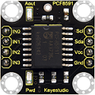 | |                                                                |                                                                                           |
| Keyestudio PCF8591 A/D Converter Module*1                    | Jumper Wires   |  Potentiometer*1    |                               |                                                              

#### 3. Component Knowledge

**Keyestudio PCF8591 A/D Converter Module：**

Raspberry Pi doesn’t come with AD/DA function. It has to be connected AD/DA shield if it is connected to analog sensor. We use pcf8591 AD/DA converter which adopts iic communication. Therefore, the operation steps are shown below:

a. Enter sudo raspi-config and press “Enter” to navigate the configuration page.

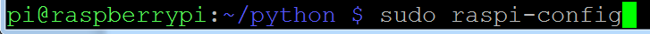

b. Enable the I2C function according to the following pictures( press（↑）,（↓）,（←）,（→）on the keyboard and “Enter”k）


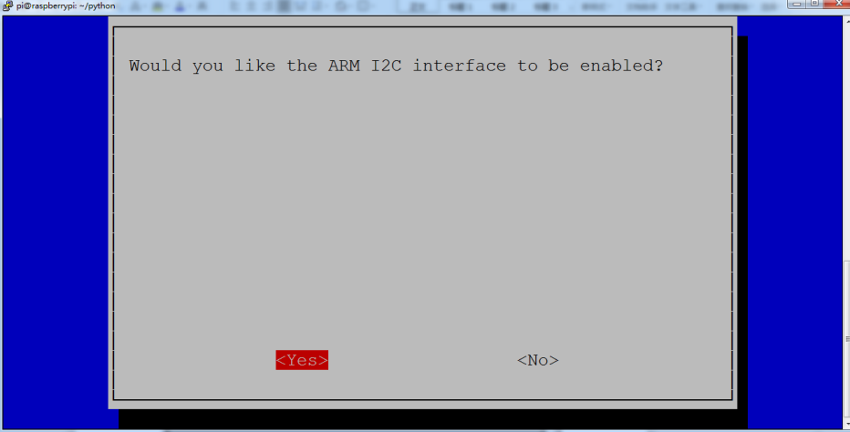

You could check more detail about I2C communication agreement in the following link: [https://www.nxp.com/docs/en/user-guide/UM10204.pdf](https://www.nxp.com/docs/en/user-guide/UM10204.pdf)


**PCF8591 Pins:**

More details about PCF8591 chip, you could look through chip specification folder

From the below figure, PCF8591 has an analog output pin Aout and four analog input pin A0-A3.


Check the address of iic module（PCF8591）of Raspberry Pi, enter command i2cdetect -y 1 and press Enter.

The iic address of PCF8591 is 0x48.


Used to read the address of pin A0\~A3.

The address of analog output pin AOUT: 0x40, that is, 64 converting from hexadecimal to decimal

A0 = 0x40 \##\##A0 ----\> port address

A1 = 0x41

A2 = 0x42

A3 = 0x43

**Adjustable Potentiometer**

The rotary potentiometer means the change of resistance.

We could convert the resistance’s change into the voltage’s when setting circuit. Then, voltage changes will be output to GPIO port through module signals.

Wiring according to the below figure and rotate clockwise, resistance value reduces.

#### 4. Schematic Diagram：


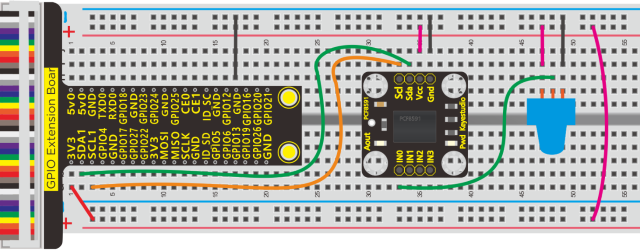

<span style="color: rgb(255, 76, 65);">Note:</span> PCF8591 module comes with an LED connected to Aout pint

#### 5. Run Example Code：

Input the following commands and press "Enter":

cd /home/pi/pythonCode_A

python 19_potentiometer-LED.py

#### 6. Test Results：

Terminal prints the analog value read by adjustable potentiometer. The LED
brightness will vary with the the rotary of potentiometer.

<span style="color: rgb(255, 76, 65);">Note:</span> Press Ctrl + C on keyboard and exit code running.

#### 7. Example Code：

```python
import smbus
import time
address = 0x48 ##default address of PCF8591
bus=smbus.SMBus(1)  ##Create an instance of smbus
cmd=0x40 ##command
## A0 = 0x40      ###A0  ----> port address
## A1 = 0x41
## A2 = 0x42
## A3 = 0x43
def analogRead(chn):   ##read ADC value,chn:0,1,2,3
    value = bus.read_byte_data(address,cmd+chn)
    return value
 
def analogWrite(value):##write DAC value
    bus.write_byte_data(address,cmd,value) 
 
def loop():
    while True:
        value = analogRead(0) ##read the ADC value ofchannel 0
        analogWrite(value) ##write the DAC value
        voltage = value / 255.0 * 3.3 ##calculate the voltage value
        print ('ADC Value : %d, Voltage : %.2f'%(value,voltage))
        time.sleep(0.01)

def destroy():
    bus.close()
 
if __name__ == '__main__':
    print ('Program is starting ... ')
    try:
        loop()
    except KeyboardInterrupt:
        destroy()
```

#### 8. Explanation：

|     smbus | Smbus is based on iic communication. We treat it as iic communication library.                                                                                                                                                      |
|-----------|-------------------------------------------------------------------------------------------------------------------------------------------------------------------------------------------------------------------------------------|
|           | bus.read_byte_data(address,cmd+chn) Read the corresponding modules with iic address，address is the address of pcf8591 module，cmd+chn correspond to the address of analog port pcf8591: A0 = 0x40，A1 = 0x41，A2 = 0x42，A3 = 0x43 |
|           | bus.write_byte_data(address,cmd,value) D/A analog value outputs, address is address of pcf8591 module，cmd outputs the address of pins，value: output value                                                                         |
|           | Smbus library file [https://pypi.org/project/smbus2/0.1.2/](https://pypi.org/project/smbus2/0.1.2/)                                                                                                                                                                        |

### Project 20： Photoresistor

#### 1. Description：

Photo resistor (Photovaristor) is a resistor whose resistance varies according to different incident light strength. It's made based on the photoelectric effect of semiconductor. In this lesson, let’s explain how it works.

#### 2. Components：

|   |  |  |  |  |
| ------------------------------------------------------------ | ------------------------------------------------------------ | ------------------------------------------------------------ | ------------------------------------------------------------ | ------------------------------------------------------------ |
| Raspberry Pi*1                                               | GPIO Extension Board*1                                       | 40 pin Colorful Jumper Wires*1                               | Breadboard*1                                                 | LED - Red *1                                                 |
|  |  |  |  | |
| 220Ω Resistor*1                                              | Photo Resistor*1                                             | 10KΩ Resistor*1                                              | Keyestudio PCF8591 A/D Converter Module*1                    | Jumper Wires                                                 |

#### 3. Component Knowledge

**Photoresistor：**

Photo resistor (Photovaristor) is a resistor whose resistance varies according to different incident light strength. It's made based on the photoelectric effect of semiconductor. If the incident light is intense, its resistance reduces; if the incident light is weak, the resistance increases.

If incident light on a photoresistor exceeds a certain frequency, photons absorbed by the semiconductor give bound electrons enough energy to jump into the conduction band. The resulting free electrons (and their hole partners) conduct electricity, thereby lowering resistance.

#### 4. Schematic Diagram：

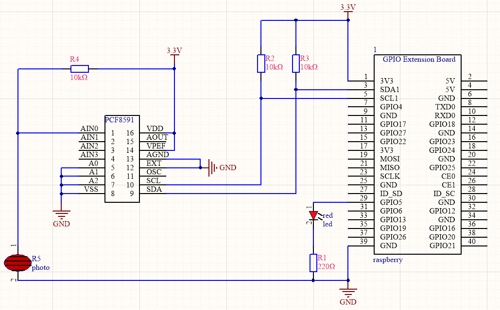


#### 5. Run Example Code：

<span style="color: rgb(255, 76, 65);">Note:</span> in the experiment, I2C communication is used. We need to check the iic address first( <span style="color: rgb(255, 76, 65);">enter command：i2cdetect -y 1 and press “Enter”. If failed, check the wiring is correct or not. If correct, you need to enable I2C communication function of Raspberry Pi, project 19 is for your reference.</span>)
<br>
<br>
After enabling I2C communication, input the following commands and press "Enter":

cd /home/pi/pythonCode_A

python 20_photo-resistor.py

#### 6. Test Results：

Terminal prints the value tested by photoresistor. LED will turn on if the ambient environment is dim, otherwise, LED will be off.

<span style="color: rgb(255, 76, 65);">Note:</span> Press Ctrl + C on keyboard and exit code running.

#### 7. Example Code：

```python
import RPi.GPIO as GPIO
import smbus   
import time

GPIO.setmode(GPIO.BCM)
GPIO.setwarnings(False)

led = 5
GPIO.setup(led,GPIO.OUT)
 
address = 0x48 ###address  ---> device address
cmd = 0x40     ###DA converter command
A0 = 0x40      ###A0  ----> port address
A1 = 0x41
A2 = 0x42
A3 = 0x43
bus = smbus.SMBus(1)            ###start the bus

def analogRead(count):   ##function,read analog data
    read_val = bus.read_byte_data(address,cmd+count)
    return read_val

while True:                     ###loop 
    ##Vout = 10                  ###10*0.0196=0.196V
    ##bus.write_byte_data(address,cmd,Vout) ###DA converter
    value = analogRead(0) ###read A0 data
    if(value<80):   ##When the ambient brightness is less than 80, the LED light will be on
        GPIO.output(led,GPIO.HIGH)
    else:
        GPIO.output(led,GPIO.LOW)

    print("data:%1.0f" %(value))   ###print data
    
time.sleep(0.5)                ###delay 0.5 second
GPIO.cleanup()
```

### Project 21： Sound-activated Light

#### 1. Description：

You might find the lights automatically on when you pass them, nevertheless, they will be off if the surrounding is quiet. Do you know why?

Actually, it is sound sensor that controls them on and off.

#### 2. Components:

|  |  |  |  | |
| ------------------------------------------------------------ | ------------------------------------------------------------ | ------------------------------------------------------------ | ------------------------------------------------------------ | ------------------------------------------------------------ |
| Raspberry Pi*1                                               | GPIO Extension Board*1                                       | 40 pin Colorful Jumper Wires*1                               | Breadboard*1                                                 | LED - Red *1                                                 |
|  | 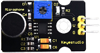 | |  |                                                               |
| 220Ω Resistor*1                                              | Sound Sensor*1                                               | Jumper Wires                                                 | Keyestudio PCF8591 A/D Converter Module*1                    |                                                              |


#### 3. Component Knowledge

A sound sensor is defined as a module that detects sound waves through its intensity and converting it to electrical signals.

The sound sensor has a built-in capacitive electret microphone which is highly sensitive to sound. Sound waves cause the thin film of the electret to vibrate and then the capacitance changes, thus producing the corresponding changed voltage. Since the voltage change is extremely weak, it needs to be amplified.

So it is converted into a voltage ranging from 0 to 5V, which is received by data acquisition unit after A/D adapter conversion and then sent to an MCU.

The module can be applied to noise monitoring in traffic artery, and detection of noises within the boundary of industrial enterprises, factories, and construction sites, detection of noises in urban regions, and noise detection and assessment of living surroundings.

#### 4. Schematic and Connection Diagram：

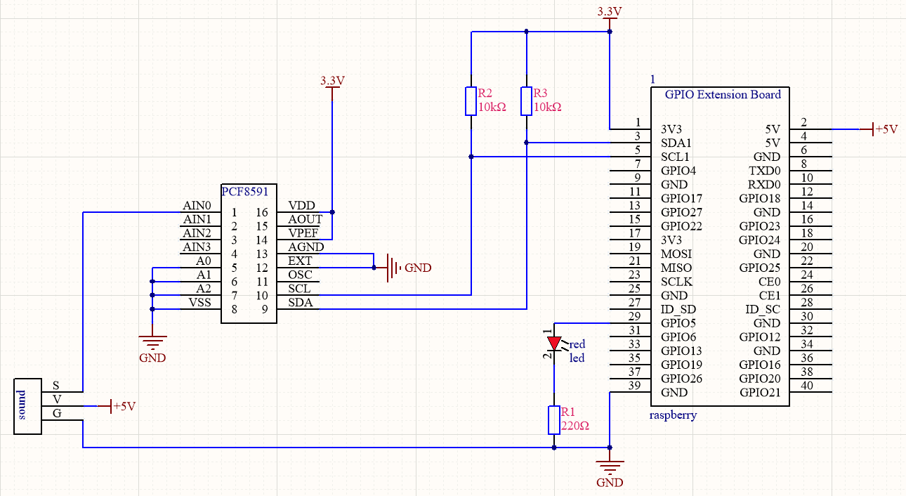


#### 5. Run Example Code：

<span style="color: rgb(255, 76, 65);">Note:</span> in the experiment, I2C communication is used. We need to check the iic address first(<span style="color: rgb(255, 76, 65);">enter command：i2cdetect -y 1 and press“Enter”. If failed, check the wiring is correct or not. If correct, you need to enable I2C communication function of Raspberry Pi, project 19 is for your reference.</span>)
<br>
<br>
After enabling the I2C communication，input the following commands and press "Enter":

cd /home/pi/pythonCode_A

python 21_sound_led.py

#### 6. Test Results：

When you clap your hands suddenly, LED lights up and clap again, LED is off.

<span style="color: rgb(255, 76, 65);">Note:</span> Press Ctrl + C on keyboard and exit code running.

#### 7. Example Code：

```python
import RPi.GPIO as GPIO
import smbus
import time

GPIO.setmode(GPIO.BCM)
GPIO.setwarnings(False)

led = 5
GPIO.setup(led,GPIO.OUT)
 
address = 0x48 ###address  ---> device address
cmd = 0x40     ###DA converter command
A0 = 0x40      ###A0  ----> port address
A1 = 0x41
A2 = 0x42
A3 = 0x43
bus = smbus.SMBus(1)            ###start the bus

flag = 0
mode = 0

def analogRead(count):   ##function,read analog data
    read_val = bus.read_byte_data(address,cmd+count)
    return read_val

while True:                     ###loop
    value = analogRead(0) ###read A0 data
    if(value>50):
        flag += 1
        mode = flag % 2
    if(mode == 0):
        GPIO.output(led,GPIO.LOW)
    else:
        GPIO.output(led,GPIO.HIGH)

    print("data:%1.0f" %(value))   ###print data
    time.sleep(0.05)                ###delay 0.05 second
    
GPIO.cleanup()
```
### Project 22： LCD1602 & MQ-2 Gas Leakage Alarm

#### 1. Description：

Some households have access to gas, which is composed of CO, CO2, N2, H2 and CH4. CO is one of toxic gases. People will be in danger if absorbing too much CO. However, we could tackle with this problem over a gas leakage alarm.

Gas MQ-2 leakage alarm detects the presence of a combustible or toxic gas and react by displaying a reading, setting off an audible or visual alarm.

#### 2. Components：

|  |    |        |  |  |  |
| ------------------------ | -------------------------- | ------------------------------ | ------------------------ | ------------------------ | ------------------------ |
| Raspberry Pi*1           | GPIO Extension Board*1     | 40 pin Colorful Jumper Wires*1 | Breadboard*1             | Potentiometer*1          | Active Buzzer *1         |
| 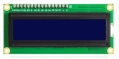 |    |        |  |  |                          |
| LCD1602 display*1        | Analog Gas MQ-2 Sensor * 1 | PCF8591 A/D Converter Module*1 | Jumper Wires             | M-F Dupont Line          |                          |

#### 3. Component Knowledge

MQ-2 gas sensor adopts the material sensitive to gas------SnO2 with low electricity conductivity. When beset with combustible gas, its electricity conductivity varies with the of the concentration of flammable gas, however, the simple circuit could convert the change of electricity conductivity into the output signals of the concentration of gas sensor.

MQ-2 gas sensor is a multi-purpose and cost-effective. It can detect the concentration of flammable gas and smoke in the range of 300\~10000ppm.Meanwhile, it has high sensitivity to natural gas, liquefied petroleum gas and other smoke, especially to alkanes smoke.

**LCD1602 LED Display：**

It could show the characters or numbers in 16 rows and 2 columns

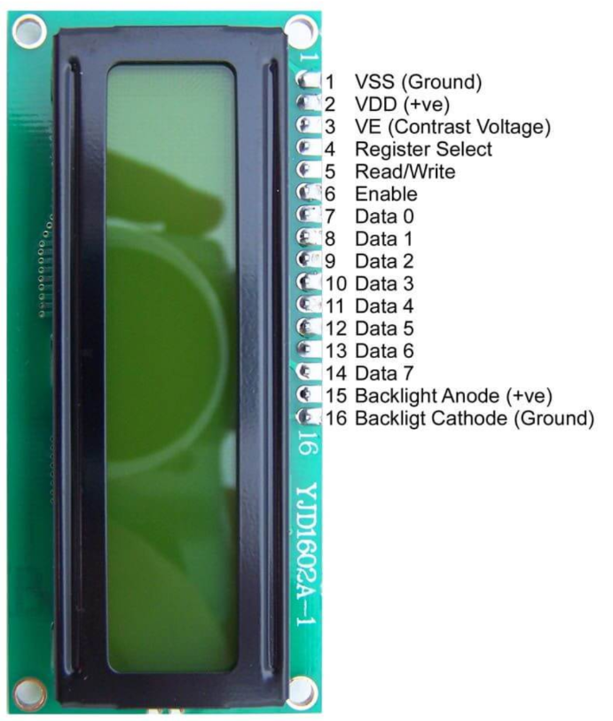

**1602 LCD Pins:**

| Pin 1     | GND                                                                                                                                                                                                                                                                           |
|-----------|-------------------------------------------------------------------------------------------------------------------------------------------------------------------------------------------------------------------------------------------------------------------------------|
| Pin 2     | VCC is connected to positive of 5V                                                                                                                                                                                                                                            |
| Pin 3     |  V0 is the contrast adjustment terminal of LCD. The contrast is the weakest when the positive power is connected, and the contrast is the highest when the power is grounded (for high contrast causing double image a 10K potentiometer can help adjust contrast during use) |
| Pin 4     | RS is register selection, select data register when high level 1 and choose command register when low level 0                                                                                                                                                                 |
| Pin 5     | RW is reading and writing signal line. Reading operation actives if high level(1)，writing operation actives ig low level(0)                                                                                                                                                  |
| Pin 6     | E(EN) is enable end, read information when high level(1), execute the command when low level(0)                                                                                                                                                                               |
| Pin 7\~14 | D0～D7 are 8-bit two-way data ends                                                                                                                                                                                                                                            |
| Pin 15    | Positive of backlight                                                                                                                                                                                                                                                         |
| Pin 16    | Negative of backlight                                                                                                                                                                                                                                                         |

LCD1602 usually uses eight data cable to provide the data of Data0\~Data7, however, it supports“4Bits”mode which is so called four data cables so as to save GPIO ports

#### 4. Schematic Diagram：


#### 5. Run Example Code：

<span style="color: rgb(255, 76, 65);">Note:</span> in the experiment, I2C communication is used. We need to check the iic address first(<span style="color: rgb(255, 76, 65);">enter command：i2cdetect -y 1 and press“Enter”. If failed, check the wiring is correct or not. If correct, you need to enable I2C communication function of Raspberry Pi, project 19 is for your reference.</span>)
<br>
<br>
After enabling the I2C communication，input the following commands and press "Enter":

cd /home/pi/pythonCode_A

python 22_LCD1602_MQ2.py

#### 6. Test Results：

Buzzer alarms when detecting the poisonous gas.

<span style="color: rgb(255, 76, 65);">Note:</span> Press Ctrl + C on keyboard and exit code running.

#### 7. Example Code：

```python
##!/usr/bin/python
##import
import RPi.GPIO as GPIO
import time
import smbus
## Define GPIO to LCD mapping
LCD_RS = 19
LCD_E  = 13
LCD_D4 = 22
LCD_D5 = 27
LCD_D6 = 17
LCD_D7 = 4
 
## Define some device constants
LCD_WIDTH = 16    ## Maximum characters per line
LCD_CHR = True
LCD_CMD = False
 
LCD_LINE_1 = 0x80 ## LCD RAM address for the 1st line
LCD_LINE_2 = 0xC0 ## LCD RAM address for the 2nd line

## Timing constants
E_PULSE = 0.0005
E_DELAY = 0.0005

##pcf8591
address=0x48
cmd=0x40
A0=0x40###A0---->port address
A1=0x41
A2=0x42
A3=0x43
bus=smbus.SMBus(1)

##buzzer
buzPin = 20  ##set buzPin to 20
GPIO.setmode(GPIO.BCM) ## use BCM numbers
GPIO.setup(buzPin,GPIO.OUT)  ##set buzPin OUTPUT mode

 
def main():
    ## Main program block
    GPIO.setwarnings(False)
    GPIO.setmode(GPIO.BCM)       ## Use BCM GPIO numbers
    GPIO.setup(LCD_E, GPIO.OUT)  ## E
    GPIO.setup(LCD_RS, GPIO.OUT) ## RS
    GPIO.setup(LCD_D4, GPIO.OUT) ## DB4
    GPIO.setup(LCD_D5, GPIO.OUT) ## DB5
    GPIO.setup(LCD_D6, GPIO.OUT) ## DB6
    GPIO.setup(LCD_D7, GPIO.OUT) ## DB7
    
    ## Initialise display
    lcd_init()
    
    while True:
        temp = analogRead(0)
        print("MQ-2 = %s"%(temp))
        ##display
        ## Send some test
        lcd_string("MQ-2",LCD_LINE_1)
        lcd_string(temp,LCD_LINE_2)
        time.sleep(0.1)

##LM35, require Temperature
def analogRead(count):
    read_val=bus.read_byte_data(address,cmd+count)
    if(read_val > 60):
        GPIO.output(buzPin,GPIO.HIGH)  ##Buzzer ring
    else:
        GPIO.output(buzPin,GPIO.LOW)  ##Buzzer stop

    mq2_val = str(read_val)  ## int to string
    return mq2_val

 
def lcd_init():
    ## Initialise display
    lcd_byte(0x33,LCD_CMD) ## 110011 Initialise
    lcd_byte(0x32,LCD_CMD) ## 110010 Initialise
    lcd_byte(0x06,LCD_CMD) ## 000110 Cursor move direction
    lcd_byte(0x0C,LCD_CMD) ## 001100 Display On,Cursor Off, Blink Off
    lcd_byte(0x28,LCD_CMD) ## 101000 Data length, number of lines, font size
    lcd_byte(0x01,LCD_CMD) ## 000001 Clear display
    time.sleep(E_DELAY)
 
def lcd_byte(bits, mode):
    ## Send byte to data pins
    ## bits = data
    ## mode = True  for character
    ##        False for command
    
    GPIO.output(LCD_RS, mode) ## RS
    
    ## High bits
    GPIO.output(LCD_D4, False)
    GPIO.output(LCD_D5, False)
    GPIO.output(LCD_D6, False)
    GPIO.output(LCD_D7, False)
    if bits&0x10==0x10:
        GPIO.output(LCD_D4, True)
    if bits&0x20==0x20:
        GPIO.output(LCD_D5, True)
    if bits&0x40==0x40:
        GPIO.output(LCD_D6, True)
    if bits&0x80==0x80:
        GPIO.output(LCD_D7, True)
    
    ## Toggle 'Enable' pin
    lcd_toggle_enable()
    
    ## Low bits
    GPIO.output(LCD_D4, False)
    GPIO.output(LCD_D5, False)
    GPIO.output(LCD_D6, False)
    GPIO.output(LCD_D7, False)
    if bits&0x01==0x01:
        GPIO.output(LCD_D4, True)
    if bits&0x02==0x02:
        GPIO.output(LCD_D5, True)
    if bits&0x04==0x04:
        GPIO.output(LCD_D6, True)
    if bits&0x08==0x08:
        GPIO.output(LCD_D7, True)
    
    ## Toggle 'Enable' pin
    lcd_toggle_enable()
 
def lcd_toggle_enable():
    ## Toggle enable
    time.sleep(E_DELAY)
    GPIO.output(LCD_E, True)
    time.sleep(E_PULSE)
    GPIO.output(LCD_E, False)
    time.sleep(E_DELAY)
 
def lcd_string(message,line):
    ## Send string to display
    
    message = message.ljust(LCD_WIDTH," ")
    
    lcd_byte(line, LCD_CMD)
    
    for i in range(LCD_WIDTH):
        lcd_byte(ord(message[i]),LCD_CHR)
        
 
if __name__ == '__main__':
 
    try:
        main()
    except KeyboardInterrupt:
        pass
    finally:
        lcd_byte(0x01, LCD_CMD)
        lcd_string("Goodbye!",LCD_LINE_1)
        GPIO.cleanup()
```

### Project 23： Water Level Monitor

Description：

If you have ever had a water heater explode or ever tried to make submersible electronics, then you know how important it is to detect when water is around. Let’s know more about water level sensor.

Components:

|  |    |        |  |  |
| ------------------------------------------------------------ | ------------------------------------------------------------ | ------------------------------------------------------------ | ------------------------------------------------------------ | ------------------------------------------------------------ |
| Raspberry Pi*1                                               | GPIO Extension Board*1                                       | 40 pin Colorful Jumper Wires*1                               | Breadboard*1                                                 | Active Buzzer *1                                             |
| 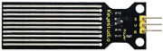   |        |  |   |                                                              |
| Water sensor * 1                                             | PCF8591 A/D Converter Module*1                               | Jumper Wires                                                 | M-F Dupont Line                                              |                                                              |

#### 3. Component Knowledge

**Water Level Sensor：**

Our water sensor is easy- to-use, portable and cost-effective, designed to identify and detect water level and water drop.

This sensor measures the volume of water drop and water quantity through an array of traces of exposed parallel wires.

It could convert water content to analog signals, and output analog value could be used by function of application. It has the features of low consumption as well.

#### 4. Schematic and Connection Diagram：

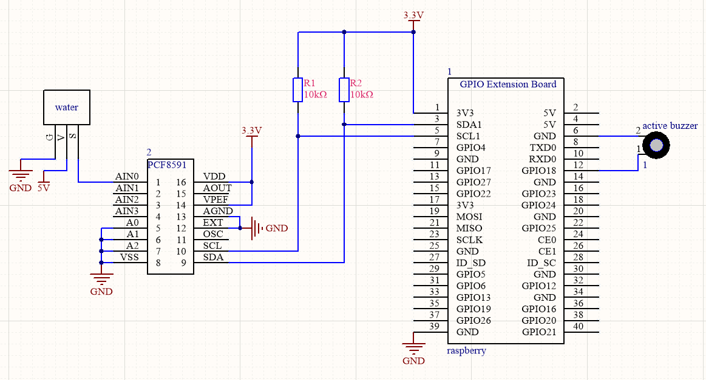


#### 5. Run Example Code：

<span style="color: rgb(255, 76, 65);">Note:</span> in the experiment, I2C communication is used. We need to check the iic address first(<span style="color: rgb(255, 76, 65);">enter command：i2cdetect -y 1 and press“Enter”. If failed, check the wiring is correct or not. If correct, you need to enable I2C communication function of Raspberry Pi, project 19 is for your reference.</span>)
<br>
<br>
After enabling the I2C communication，input the following commands and press "Enter":

cd /home/pi/pythonCode_A

python 23_water_buzzer.py

#### 6. Test Results：

Buzzer makes a sound when water covering the exposed detection part.

<span style="color: rgb(255, 76, 65);">Note:</span> Press Ctrl + C on keyboard and exit code running.

#### 7. Example Code：

```python
import RPi.GPIO as GPIO
import smbus
import time

GPIO.setmode(GPIO.BCM)
GPIO.setwarnings(False)

buz = 18
GPIO.setup(buz,GPIO.OUT)
 
address = 0x48 ###address  ---> device address
cmd = 0x40     ###DA converter command
A0 = 0x40      ###A0  ----> port address
A1 = 0x41
A2 = 0x42
A3 = 0x43
bus = smbus.SMBus(1)            ###start the bus


def analogRead(count):   ##function,read analog data
    read_val = bus.read_byte_data(address,cmd+count)
    return read_val

while True:                     ###loop
    value = analogRead(0) ###read A0 data
    if(value>30):
        GPIO.output(buz,GPIO.HIGH)
    else:
        GPIO.output(buz,GPIO.LOW)

    print("data:%1.0f" %(value))   ###print data
    time.sleep(0.05)                ###delay 0.05 second
    
GPIO.cleanup()
```
### Project 24： 5V Relay + Water Pump

#### 1. Description：

From a safety perspective, we specially designed this relay module with NO (normally open) and NC (normally closed) terminals. In this lesson, we will learn a special and easy-to-use switch, which is the relay module. Use the relay to start the motor.

In daily life, the electronic device is driven by 220V AC and controlled by switch. People will be in danger once the electricity leakage happens, connecting switch to 220V AC directly.

Therefore, we design a relay module with NO and NC ends. Let’s get started.

#### 2. Components：

|   |    |        |  | 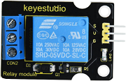 |
| ------------------------------------------------------------ | ------------------------------------------------------------ | ------------------------------------------------------------ | ------------------------------------------------------------ | ------------------------------------------------------------ | 
| Raspberry Pi*1                                               | GPIO Extension Board*1                                       | 40pin Colorful Jumper Wires*1                                | Breadboard*1                                                 | Relay Module*1                                               |
| |  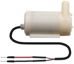|  |  ||                                                            
| M-F Dupont Line                                              | Water Pump*1 | Screwdriver*1                                                | Jumper Wires                                                 | Water Pipe*1                                                 |                                                            

#### 3. Component Knowledge

**Relay:** It is an "automatic switch" that uses a small current to control the operation of a large current.

Control input voltage: 5V

Rated load: 5A 250VAC (NO/NC) 5A 24VDC (NO/NC)

**Water Pump**

-   Working voltage: DC3-5V,

-   Working current: 100-200mA,

-   Head: 0.3-0.8 meters,

-   Flow rate: 1.2-1.6L/min,

-   Weight: 28 grams

#### 4. Schematic Diagram：

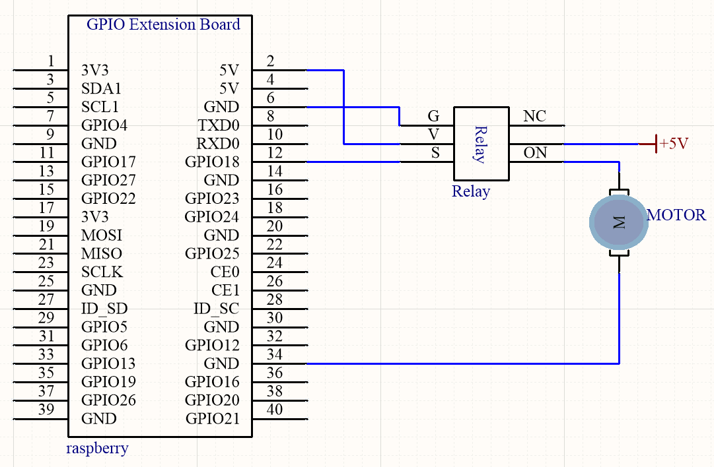

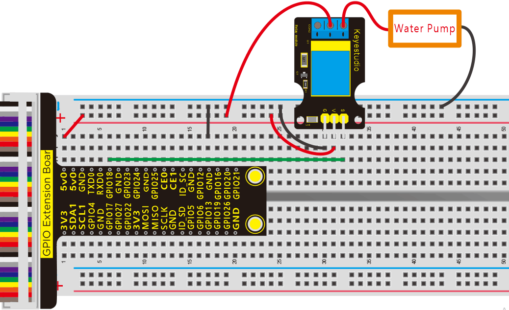

#### 5. Run Example Code：

Input the following commands and press "Enter":

cd /home/pi/pythonCode_A

python 24_relay.py

#### 6. Test Results：

Water pump activates when the indication on relay module turns on.

<span style="color: rgb(255, 76, 65);">Note:</span> Press Ctrl + C on keyboard and exit code running.

#### 7. Example Code：

```python
import RPi.GPIO as GPIO
from time import sleep

relayPin = 18   ##define relay pin

GPIO.setmode(GPIO.BCM)
GPIO.setwarnings(False)
GPIO.setup(relayPin,GPIO.OUT)

while True:
	GPIO.output(relayPin,GPIO.HIGH)  ##Starting relay
	print("turn on")
	sleep(5)
	GPIO.output(relayPin,GPIO.LOW)  ##Close relay
	print("turn off")
	sleep(1)

GPIO.cleanup()
```

### Project 25：Watering Flower Device

#### 1. Description：

The household plants are popular in many a communities. They will die if you forget to water them, how about making an automatic watering device?

#### 2. Components：

|   |    |        |  | 
| ------------------------------------------------------------ | ------------------------------------------------------------ | ------------------------------------------------------------ | ------------------------------------------------------------ | 
| Raspberry Pi*1                                               | GPIO Extension Board*1                                       | 40 pin Colorful Jumper Wires*1                               | Breadboard*1                                                 |
| | 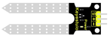|  |   | 
| Water Pump*1                                                 | Soil Humidity Sensor*1                                       | Keyestudio PCF8591 A/D Converter Module*1                    | Relay Module*1                                        | 
| | | |                                    |                                                             
| M-F Dupont Line                                              | Jumper Wires                                                 | Screwdriver*1                                                |                                                          Water Pipe*1     |                                                            

#### 3. Component Knowledge

**Soil Humidity Sensor：**

This is a simple soil humidity sensor aims to detect the soil humidity.

If the soil is in lack of water, the analog value output by the sensor will decrease; otherwise, it will increase. If you use this sensor to make an automatic watering device, it can detect whether your botany is thirsty to prevent it from withering when you go out.

Using the sensor with controller makes your plant more comfortable and your garden smarter. The soil humidity sensor module is not as complicated as you might think, and if you need to detect the soil in your project, it will be your best choice.

#### 4. Schematic Diagram：

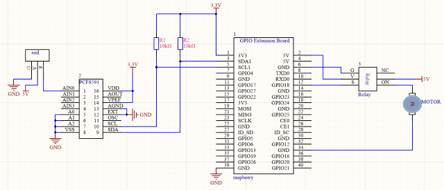

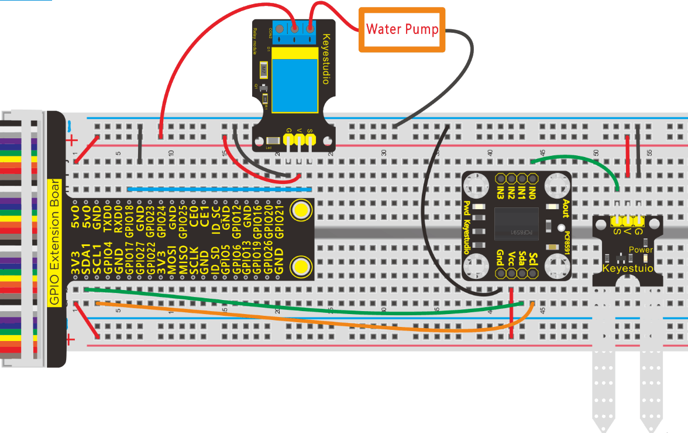

#### 5. Run Example Code：

<span style="color: rgb(255, 76, 65);">Note:</span> in the experiment, I2C communication is used. We need to check the iic address first(<span style="color: rgb(255, 76, 65);">enter command：i2cdetect -y 1 and press“Enter”. If failed, check the wiring is correct or not. If correct, you need to enable I2C communication function of Raspberry Pi, project 19 is for your reference.</span>)
<br>
<br>
After enabling the I2C communication，input the following commands and press "Enter":

cd /home/pi/pythonCode_A

python 25_soil.py

#### 6. Test Results：

Water pump starts running when soil humidity sensor detects the drought of soil.

<span style="color: rgb(255, 76, 65);">Note:</span> Press Ctrl + C on keyboard and exit code running.

#### 7. Example Code：

```python
import RPi.GPIO as GPIO
import smbus   
import time

GPIO.setmode(GPIO.BCM)
GPIO.setwarnings(False)

pumpPin = 18
GPIO.setup(pumpPin,GPIO.OUT)
 
address = 0x48 ###address  ---> device address
cmd = 0x40     ###DA converter command
A0 = 0x40      ###A0  ----> port address
A1 = 0x41
A2 = 0x42
A3 = 0x43
bus = smbus.SMBus(1)            ###start the bus
while True:                     ###loop 
    ##Vout = 10                  ###10*0.0196=0.196V
    ##bus.write_byte_data(address,cmd,Vout) ###DA converter
    bus.write_byte(address,A0)     ###which port of the device you want to access
    value = bus.read_byte(address) ###access the data
    if(value<30):    ##When the soil moisture value is less than 50, turn on the relay to start the water pump
        GPIO.output(pumpPin,GPIO.HIGH)
    else:
        GPIO.output(pumpPin,GPIO.LOW)
    print("data:%1.0f" %(value))   ###print data
    
time.sleep(0.5)                ###delay 0.5 second
GPIO.cleanup()
```
### Project 26：Servo

Description：

Servo is applied widely, especially for robot like human robots and moving robots. In this lesson, we will learn how it works.

Components：

|  |    |        |   | | |
| ------------------------------------------------------------ | ------------------------------------------------------------ | ------------------------------------------------------------ | ------------------------------------------------------------ | ------------------------------------------------------------ | ------------------------------------------------------------ |
| Raspberry Pi*1                                               | GPIO Extension Board*1                                       | 40 pin Colorful Jumper Wires*1                               | Breadboard*1                                                 | Servo Motor*1                                                | Jumper Wires                                                 |

#### 3. Component Knowledge

**Servo:**

A location(angle) driver which can rotate a certain angle with high accuracy. It has three external wires which are brown, red and orange,. Brown one is grounded, red one is positive pole of power and orange one is signal wire.

The rotation angle of servo motor is controlled by regulating the duty cycle of PWM (Pulse-Width Modulation) signal. The standard cycle of PWM signal is 20ms (50Hz). Theoretically, the width is distributed between 1ms-2ms, but in fact, it's between 0.5ms-2.5ms. The width corresponds the rotation angle from 0° to 180°. But note that for different brand motor, the same signal may have different rotation angle.

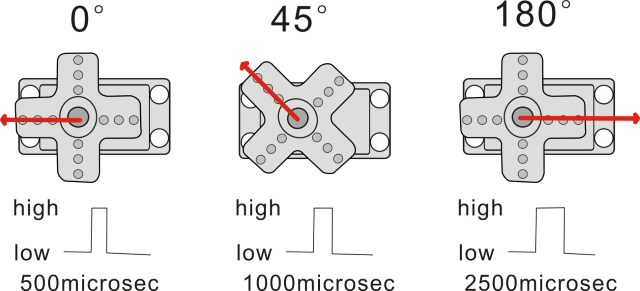

#### 4. Schematic Diagram：

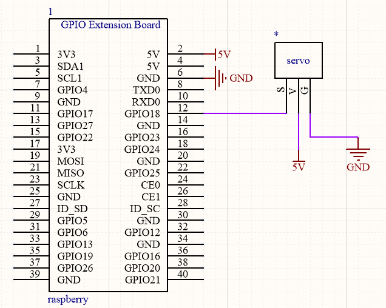

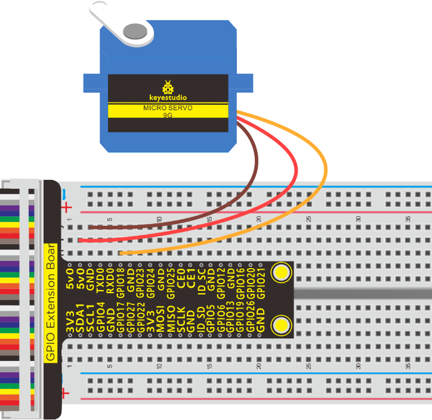

#### 5. Run Example Code：

Input the following commands and press "Enter":

cd /home/pi/pythonCode_A

python 26_servo.py

#### 6. Test Results：

Enter the angle value and servo rotates the corresponding value, as shown below:

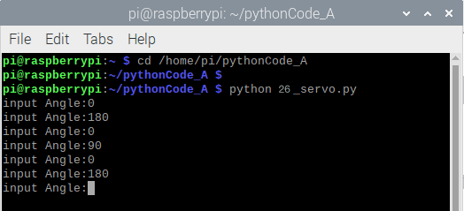

<span style="color: rgb(255, 76, 65);">Note:</span> Press Ctrl + C on keyboard and exit code running.

#### 7. Example Code：

```python
import RPi.GPIO as GPIO
import time

servo_min_angle = 2.5  ##define pulse duty cycle for minimun angle of servo
servo_max_angle = 12.5  ##define pulse duty cycle for maximun angle of servo

servopin = 18   ##servo Pin
GPIO.setmode(GPIO.BCM)  ##BCM numbers

GPIO.setup(servopin,GPIO.OUT)
p = GPIO.PWM(servopin,50)  ##set 50Hz , The working frequency of the steering gear is 50Hz
p.start(0)  ## start PWM
time.sleep(2)

##define function, map a value from one range to another range
def map(angle, val1, val2, min_angle, max_angle):
    return (max_angle-min_angle)*(angle-val1)/(val2-val1)+min_angle

while(True):  ##loop
    p.ChangeDutyCycle(0)   ##set 
    time.sleep(0.4)
    b = input("input Angle:")
    b = int(b)
    c = map(b, 0, 180, servo_min_angle, servo_max_angle)  ##map angle from 0~180 to 2.5~12.5
    p.ChangeDutyCycle(c) 
    time.sleep(0.4)
    
p.stop()
GPIO.cleanup()
```

### Project 27： L293D Driver Motor

#### 1. Description：

In generally, we use a DC motor to make smart car. What should we do if we want to control the rotation speed and direction? Here, we need an L293D driver motor.

#### 2. Components:

|  |    |        |  | |
| ------------------------------------------------------------ | ------------------------------------------------------------ | ------------------------------------------------------------ | ------------------------------------------------------------ | ------------------------------------------------------------ |
| Raspberry Pi*1                                               | GPIO Extension Board*1                                       | 40 pin Colorful jumper Wires*1                               | Breadboard*1                                                 | Jumper Wires                                                 |
|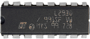 |    |  |                                                              |                                                              |
| L293D Chip*1                                                 | Fan                                                          | Motor*1                                                      |                                                              |                                                              |

#### 3. Component Knowledge:

**L293D Chip:**

It is a DC current DC IC which is applied to drive DC motor and stepper motor. In addition, it has 16 pins driving two-way DC motor at same time.

Input voltage range: 4.5 V \~ 36 V

Output current: MAX 600mA, can drive inductive loaded, especially its input end can be connected to MCU directly, controlled by MCU easily.

The two-channel motor can be driven and rotate clockwise and anticlockwise when changing the high and low level on input port.


| \## | Pin Name | Description                                         |
|----|----------|-----------------------------------------------------|
| 1  | Enable1  | Enable pin input 1(2) and Input 2(7)                |
| 2  | In1      | Control output1 and controlled  by digital circuit  |
| 3  | Out1     | Connect one end of motor1                           |
| 4  | 0V       | Connected to 0V of circuit.                         |
| 5  | 0V       | Connected to 0V of circuit.                         |
| 6  | Out2     | Connect the other end of motor1                     |
| 7  | In2      | Control output2 and controlled  by digital circuit  |
| 8  | +V motor | Connect to 4.5V-36V) of motor                       |
| 9  | Enable2  | Enable pin input 3(10) and 4(15)                    |
| 10 | In3      | Control output pin 3                                |
| 11 | Out3     | Connect one end of motor 2                          |
| 12 | 0V       | Connected to 0V of circuit.                         |
| 13 | 0V       | Connected to 0V of circuit.                         |
| 14 | Out4     | Connect the other end of motor 2                    |
| 15 | In4      | Control output 4 and controlled by  digital circuit |
| 16 | +V       | Connect to + 5V to enable IC function               |

#### 4. Schematic Diagram：


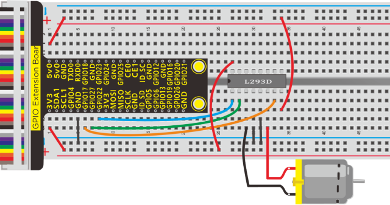

#### 5. Run Example Code：

Input the following commands and press "Enter":

cd /home/pi/pythonCode_A

python 27_L293D_motor.py

#### 6. Test Results：

Motor rotates clockwise for 3s, stops for 2s, anticlockwise for 3s and stops for 2 s.

<span style="color: rgb(255, 76, 65);">Note:</span> Press Ctrl + C on keyboard and exit code running.

#### 7. Example Code：

```python
import RPi.GPIO as GPIO
import time

##define L293D pin
INA1 = 17
INA2 = 27
ENA = 22


GPIO.setmode(GPIO.BCM)

GPIO.setup(INA1,GPIO.OUT)
GPIO.setup(INA2,GPIO.OUT)
GPIO.setup(ENA,GPIO.OUT)

pwmA = GPIO.PWM(ENA,100)  ##create a PWM instance
pwmA.start(0)   ##start PWM

def forward():
    GPIO.output(INA1,GPIO.HIGH)
    GPIO.output(INA2,GPIO.LOW)
    pwmA.ChangeDutyCycle(100)
    
def back():
    GPIO.output(INA1,GPIO.LOW)
    GPIO.output(INA2,GPIO.HIGH)
    pwmA.ChangeDutyCycle(70)
    
def stop():
    pwmA.ChangeDutyCycle(0)
    
    
while True:     ##loop
    forward()
    time.sleep(3)
    stop()
    time.sleep(2)
    back()
    time.sleep(3)
    stop()
    time.sleep(2)
    

pwmA.stop()  ##stop PWM
GPIO.cleanup()    ##release all GPIO
```

### Project 28： ULN2003 Stepper Motor Driver

#### 1. Description：

Stepper motor is applied widely in our daily life, such as hard drives, 3D printers, CNC machine tools, robots, etc.

Let’s get started with stepper motor.

#### 2. Components：

|  |    |        |  |
| ------------------------------------------------------------ | ------------------------------------------------------------ | ------------------------------------------------------------ | ------------------------------------------------------------ |
| Raspberry Pi*1                                               | GPIO Extension Board*1                                       | 40 pin Colorful Jumper Wires*1                               | Breadboard*1                                                 |
|  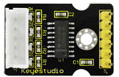 |    |        | |
| Driver Board ULN2003*1                                       | Keyestudio 5V 4-Phase Stepper Motor*1                        | M-F Dupont Line                                              | Jumper Wires                                                 |

#### 3. Component Knowledge:

**28BYJ-48 Stepper Motor：**

Stepper motor consists of stators and rotors. Stators are fixed, as shown below, which are the part A, B, C and D coils surround. The coil set will produce magnetic field when electrified. The rotor is the rotation part( the centre part of stators), as shown below:


Single -Phase four Beat

The poles of rotor point at A coil when it is electrified, then it is disconnected, B is connected, rotor rotates to C; then C is disconnected and D is connected, rotor rotates to D; however, D is disconnected and A is electrified, rotor rotates to A. Therefore, rotor turns 180° and continuously rotates B-C-D-A, which means it runs a circle (eight phase). As shown below, the rotation principle of stepper motor is A - B - C - D - A

The poles of rotor points at A coil when A is electrified; then it is cut, B coil is connected.

You make order inverse(D - C - B - A - D .....) if you want to make stepper motor rotate anticlockwise.


Half-phase and eight beat：

8 beat adopts single and dual beat way，A - AB - B - BC - C - CD - D - DA - A...... ，rotor will rotate half phase in this order. For example, when A coil is electrified，rotor faces to A coil then A and B coil are connected, on this condition, the strongest magnetic field produced lies in the central part of AB coil, which means rotating half-phase clockwise.

**Stepper Motor Parameters**：

The rotor rotates one circle when the stepper motor we provide rotates 32 phases and with the output shaft driven by 1:64 reduction geared set.

Therefore the rotation (a circle) of output shaft requires 2048 phases

The step angle of 4-beat mode of 5V and 4-phase stepper motor

is 11.25. And the step angle of 8-beat mode is 5.625, the reduction ratio is 1:64.


#### 4. Schematic Diagram:


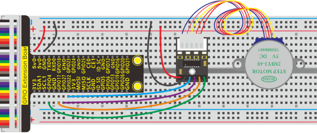

#### 5. Run Example Code：

Input the following commands and press "Enter":

cd /home/pi/pythonCode_A

python 28_ULN2003.py

#### 6. Test Results：

Rotate anticlockwise for one circle and stop for 3s and one circle in clockwise orientation, stop for 3s.

<span style="color: rgb(255, 76, 65);">Note:</span> Press Ctrl + C on keyboard and exit code running.

#### 7. Example Code：

for single-phase four beat

```python
import RPi.GPIO as GPIO
import time
GPIO.setwarnings(False)
GPIO.setmode(GPIO.BCM)       ## Numbers GPIOs by physical location
 
IN1 = 22   
IN2 = 27
IN3 = 17
IN4 = 4
GPIO.setup(IN1, GPIO.OUT)      ## Set pin's mode is output
GPIO.setup(IN2, GPIO.OUT)
GPIO.setup(IN3, GPIO.OUT)
GPIO.setup(IN4, GPIO.OUT)
 
##Output the high and low level of each pin to drive the stepping motor
def setStep(w1, w2, w3, w4):  
	GPIO.output(IN1, w1)
	GPIO.output(IN2, w2)
	GPIO.output(IN3, w3)
	GPIO.output(IN4, w4)
 
def stop():                     ## stop
	setStep(0, 0, 0, 0)
 
def backward(delay, steps):       ## Counterclockwise rotation
	for i in range(0, steps):
		setStep(1, 0, 0, 0)
		time.sleep(delay)
		setStep(0, 1, 0, 0)
		time.sleep(delay)
		setStep(0, 0, 1, 0)
		time.sleep(delay)
		setStep(0, 0, 0, 1)
		time.sleep(delay)
 
def forward(delay, steps):     ##lockwise rotation
	for i in range(0, steps):
		setStep(0, 0, 0, 1)
		time.sleep(delay)
		setStep(0, 0, 1, 0)
		time.sleep(delay)
		setStep(0, 1, 0, 0)
		time.sleep(delay)
		setStep(1, 0, 0, 0)
		time.sleep(delay)
 
def loop():
	while True:
		print "backward..."
		backward(0.003, 512)  ## One cycle, four beats, four steps, so 2048/4 = 512 cycles to make one rotation
		
		print "stop..."
		stop()                 ## stop
		time.sleep(3)          ## sleep 3s
		
		print "forward..."
		forward(0.003, 512)
		
		print "stop..."
		stop()
		time.sleep(3)
 
if __name__ == '__main__':         ## Program start from here
	try:
		loop()
	except KeyboardInterrupt:  ## When 'Ctrl+C' is pressed.
	    GPIO.cleanup()     ## Release resource
```

### Project 29： Thermometer

#### 1. Description：

We will teach you how to make a thermometer. Does it sound interesting?

#### 2. Components：

|  |  |  | |  |
| ------------------------------------------------------------ | ------------------------------------------------------------ | ------------------------------------------------------------ | ------------------------------------------------------------ | ------------------------------------------------------------ |
| Raspberry Pi*1                                               | GPIO Extension Board*1                                       | 40 pin Colorful Jumper Wires*1                               | Breadboard*1                                                 | Potentiometer*1                                              |
| | 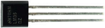|  | |                                                              |
| LCD 1602 display*1                                           | LM35-DZ * 1                                                  | Keyestudio PCF8591 A/D Converter Module*1                    | Jumper Wires                                                 |                                                              |


#### 3. Component Knowledge

It is widely used temperature sensor whose output voltage proportional to temperature. It outputs 0°at the beginning since it adopts internal compensation. Its sensitivity is 10mV/℃ and output temperature in the range of 0℃～100℃.

Transfer formula: output 0V when 0°, plus 1° each time, output voltage increases 10mV.


Note: VCC is connected to （+）, GND to （-）. LM35-DZ will be burned if connecting inversely

#### 4. Schematic Diagram：

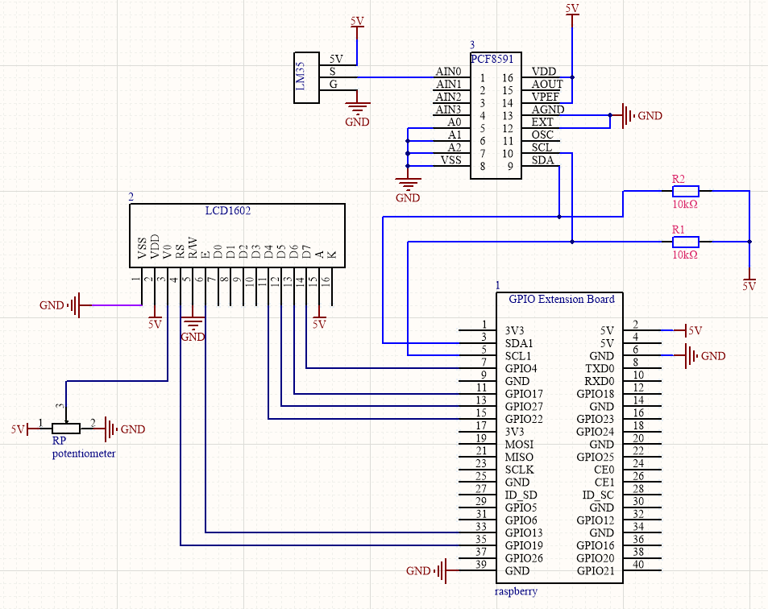

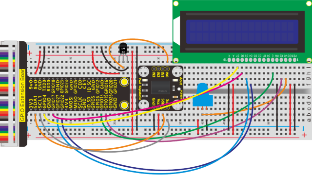

#### 5. Run Example Code：

<span style="color: rgb(255, 76, 65);">Note:</span> in the experiment, I2C communication is used. We need to check the iic address first(<span style="color: rgb(255, 76, 65);">enter command：i2cdetect -y 1 and press“Enter”. If failed, check the wiring is correct or not. If correct, you need to enable I2C communication function of Raspberry Pi, project 19 is for your reference.</span>)
<br>
<br>
After activating the I2C communication function of Raspberry Pi，input the following commands and press "Enter":

cd /home/pi/pythonCode_A

python 29_LM35.py

#### 6. Test Results：

LCD1602 displays the temperature value.

<span style="color: rgb(255, 76, 65);">Note: </span>Press Ctrl + C on keyboard and exit code running.

#### 7. Example Code：

```python
##!/usr/bin/python
##import
import RPi.GPIO as GPIO
import time
import smbus
## Define GPIO to LCD mapping
LCD_RS = 19
LCD_E  = 13
LCD_D4 = 22
LCD_D5 = 27
LCD_D6 = 17
LCD_D7 = 4
 
## Define some device constants
LCD_WIDTH = 16    ## Maximum characters per line
LCD_CHR = True
LCD_CMD = False
 
LCD_LINE_1 = 0x80 ## LCD RAM address for the 1st line
LCD_LINE_2 = 0xC0 ## LCD RAM address for the 2nd line
 
## Timing constants
E_PULSE = 0.0005
E_DELAY = 0.0005

address=0x48
cmd=0x40
A0=0x40###A0---->port address
A1=0x41
A2=0x42
A3=0x43
bus=smbus.SMBus(1)
 
def main():
    ## Main program block
    GPIO.setwarnings(False)
    GPIO.setmode(GPIO.BCM)       ## Use BCM GPIO numbers
    GPIO.setup(LCD_E, GPIO.OUT)  ## E
    GPIO.setup(LCD_RS, GPIO.OUT) ## RS
    GPIO.setup(LCD_D4, GPIO.OUT) ## DB4
    GPIO.setup(LCD_D5, GPIO.OUT) ## DB5
    GPIO.setup(LCD_D6, GPIO.OUT) ## DB6
    GPIO.setup(LCD_D7, GPIO.OUT) ## DB7
    
    ## Initialise display
    lcd_init()
    
    while True:
        temp = analogRead(0)
        print("Temp = %s"%(temp))
        ##display
        ## Send some test
        lcd_string("Rasbperry Pi",LCD_LINE_1)
        lcd_string(temp,LCD_LINE_2)
        time.sleep(0.1);

##LM35, require Temperature
def analogRead(count):
    read_val=bus.read_byte_data(address,cmd+count)
    Temp_val = (read_val*500)/256  ##Calculate the degree Celsius
    Temp_val = str(Temp_val)  ## int to string
    ##Temp_val = str(read_val)
    return Temp_val

 
def lcd_init():
    ## Initialise display
    lcd_byte(0x33,LCD_CMD) ## 110011 Initialise
    lcd_byte(0x32,LCD_CMD) ## 110010 Initialise
    lcd_byte(0x06,LCD_CMD) ## 000110 Cursor move direction
    lcd_byte(0x0C,LCD_CMD) ## 001100 Display On,Cursor Off, Blink Off
    lcd_byte(0x28,LCD_CMD) ## 101000 Data length, number of lines, font size
    lcd_byte(0x01,LCD_CMD) ## 000001 Clear display
    time.sleep(E_DELAY)
 
def lcd_byte(bits, mode):
    ## Send byte to data pins
    ## bits = data
    ## mode = True  for character
    ##        False for command
    
    GPIO.output(LCD_RS, mode) ## RS
    
    ## High bits
    GPIO.output(LCD_D4, False)
    GPIO.output(LCD_D5, False)
    GPIO.output(LCD_D6, False)
    GPIO.output(LCD_D7, False)
    if bits&0x10==0x10:
        GPIO.output(LCD_D4, True)
    if bits&0x20==0x20:
        GPIO.output(LCD_D5, True)
    if bits&0x40==0x40:
        GPIO.output(LCD_D6, True)
    if bits&0x80==0x80:
        GPIO.output(LCD_D7, True)
    
    ## Toggle 'Enable' pin
    lcd_toggle_enable()
    
    ## Low bits
    GPIO.output(LCD_D4, False)
    GPIO.output(LCD_D5, False)
    GPIO.output(LCD_D6, False)
    GPIO.output(LCD_D7, False)
    if bits&0x01==0x01:
        GPIO.output(LCD_D4, True)
    if bits&0x02==0x02:
        GPIO.output(LCD_D5, True)
    if bits&0x04==0x04:
        GPIO.output(LCD_D6, True)
    if bits&0x08==0x08:
        GPIO.output(LCD_D7, True)
    
    ## Toggle 'Enable' pin
    lcd_toggle_enable()
 
def lcd_toggle_enable():
    ## Toggle enable
    time.sleep(E_DELAY)
    GPIO.output(LCD_E, True)
    time.sleep(E_PULSE)
    GPIO.output(LCD_E, False)
    time.sleep(E_DELAY)
 
def lcd_string(message,line):
    ## Send string to display
    
    message = message.ljust(LCD_WIDTH," ")
    
    lcd_byte(line, LCD_CMD)
    
    for i in range(LCD_WIDTH):
        lcd_byte(ord(message[i]),LCD_CHR)
        
 
if __name__ == '__main__':  ## Program entrance
 
    try:
        main()  ##call main()
    except KeyboardInterrupt:
        pass
    finally:
        lcd_byte(0x01, LCD_CMD)
        GPIO.cleanup()
```

### Project 30：DHT11 Temperature and Humidity Sensor

#### 1. Description：

In this lesson, we will show you how temperature and humidity sensor works.

#### 2. Components：

|   |  |  | |
| ------------------------------------------------------------ | ------------------------------------------------------------ | ------------------------------------------------------------ | ------------------------------------------------------------ |
| Raspberry Pi*1                                               | GPIO Extension Board*1                                       | 40 pin ColorfulJumper Wires*1                                | Breadboard*1                                                 |
| 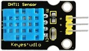 |  |                                                              |                                                              |
| DHT11 Temperature and Humidity Sensor*1                      | Jumper Wires                                                 |                                                              |                                                              |

#### 3. Component Knowledge

**DHT11 Temperature Humidity Sensor：**

It is a composite sensor which contains a calibrated digital signal output of the temperature and humidity.

The sensor can measure temperature from 0°C to 50°C and humidity from 20% to 90% with an accuracy of ±1°C and ±1%. So if you are looking to measure in this range then this sensor might be the right choice for you.

The DHT11 temperature and humidity sensor uses dedicated digital module acquisition technology and temperature and humidity sensing technology to ensure that the product has extremely high reliability and excellent long-term stability. It includes a resistive humidity sensing element and an NTC temperature measurement element, which is very suitable for temperature and humidity measurement occasions that do not require high accuracy and real-time. The working voltage is in the range of 3.3V-5.5V.

In addition, it comes with a dedicated NTC to measure temperature and an 8-bit microcontroller to output the values of temperature and humidity as serial data.

DHT11 has three pins which are VCC，GND and S.

S is data output pin and uses serial communication.

**DHT11 Temperature and Humidity 1-wire Bus Format Definition**

| **Name**        | **1-wire Bus Format Definition**                                                                                                                                 |
|-----------------|------------------------------------------------------------------------------------------------------------------------------------------------------------------|
| Initial Signal  | MCU pulls data bus（SDA）down at least 18ms（no more than 30ms）and inform sensor to prepare data                                                                |
| Response Signal | Sensor pulls data bus（SDA）down for 83µs and up for 87µs to response the initial signal of host                                                                 |
| Humidity        | Humidity high bit is part humidity integer data and humidity low bit is the part decimal data                                                                    |
| Temperature     | Humidity high bit is part humidity integer data and humidity low bit is the part decimal data. Bit8 means negative temperature, otherwise positive temperature   |
| Parity Bit      | ＝Humidity high bit+ Humidity low bit+temperature high bit+temperature low bit                                                                                   |

**Sequence Diagram：**

DHT11 switches low consumption mode to high consumption mode after the user host（MCU）sends a start signal. Then DHT11 will emit a response signal and 40bit data and trigger a information collection, as shown below:

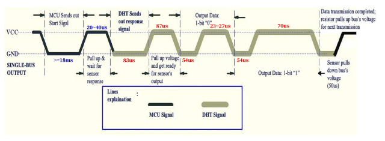Detailed DHT11 protocol：

[https://www.mouser.com/datasheet/2/758/DHT11-Technical-Data-Sheet-Translated-Version-1143054.pdf](https://www.mouser.com/datasheet/2/758/DHT11-Technical-Data-Sheet-Translated-Version-1143054.pdf)

#### 4. Schematic Diagram：


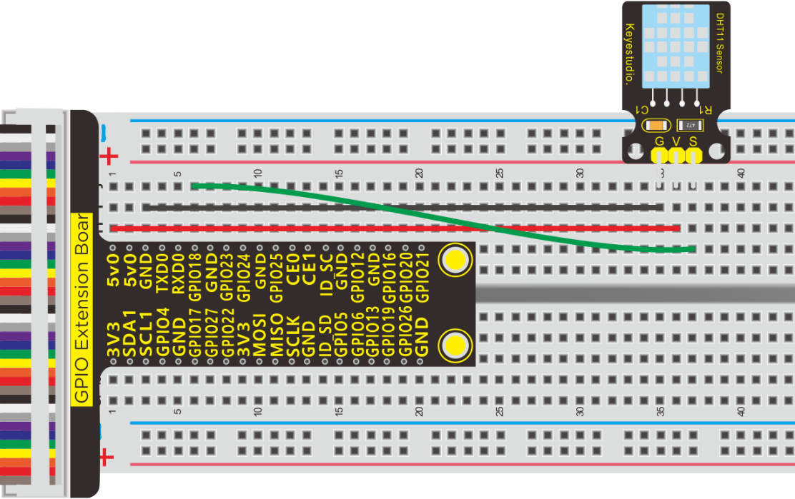

#### 5. Run Example Code：

Input the following commands and press "Enter":

cd /home/pi/pythonCode_A

python 30_DHT11.py

#### 6. Test Results：

Terminal prints the temperature and humidity value.

<span style="color: rgb(255, 76, 65);">Note:</span> Press Ctrl + C on keyboard and exit code running.

#### 7. Example Code：

```python
## -*- coding: utf-8 -*-
import RPi.GPIO as GPIO   ##import the GPIO module from RPI.GPIO.
import time               ##import the time module.
dhtPin = 18                ##set 'dhtPin' as digital 18.
 
GPIO.setmode(GPIO.BCM)    ##set gpio as BCM mode.
time.sleep(1)             ##delay 1 second.
data=[]                   ##init array

def test():
    loopCnt = 0
    ##Host signal start
    GPIO.setup(dhtPin, GPIO.OUT) ##To send a start signal, set the pin to output
    GPIO.output(dhtPin, GPIO.LOW)##Pin output low level
    time.sleep(0.02)              ##delay 0.02 second. >=18ms Host start signal
    GPIO.output(dhtPin, GPIO.HIGH) ##Pin output high level
    time.sleep(0.00004)          ##delay 40us.
    ##End of host signal

    ##Read-signal preparation
    GPIO.setup(dhtPin, GPIO.IN)  ##set gpio 9 as input mode.
    loopCnt = 0
    while GPIO.input(dhtPin)==GPIO.LOW:  ##The normal low level here is 83US
        loopCnt +=1
        time.sleep(0.000001)
        if loopCnt > 100:       ##It's wrong if the time is greater than 83US
            print("time out 2!")  ##Print out time Out 2! Indicates that the data is wrong here
            break    ##Exit the loop
    loopCnt = 0
    while GPIO.input(dhtPin)==GPIO.HIGH: ##The normal low level here is 87US
        loopCnt +=1
        time.sleep(0.000001)
        if loopCnt > 100:       ##It's an error if the time is greater than 87US
            print("time out 3!")  ##Print out time Out 3! Indicates that the data is wrong here
            break   ##Exit the loop
    ##Read signal ready to end
    ##Start reading 40 bits of data
    j = 0
    while j < 40:     ##store 40 piecs of data.
        loopCnt = 0
        ##The low level of 54MS is read, and each bit of data starts at the low level of 54US
        while GPIO.input(dhtPin) == GPIO.LOW:   ##Instead of checking the 54US low level, we just wait for the low level to pass
            loopCnt +=1
            if loopCnt > 50000:  ##If the low level is too long, it is not correct and the terminal prints time out 4! And exit the loop
               print("time out 4!")
               break
     
        start_time = time.time()  ##Record the moment when the high level reading begins
        loopCnt = 0
        while GPIO.input(dhtPin) == GPIO.HIGH:   ##Wait for the high level to pass
            loopCnt +=1
            if loopCnt > 50000:
               print("time out 5!")
               break

        stop_time = time.time() ##The moment when the high level ends
        t = stop_time - start_time ##Figure out the time it takes to read to the high level
        ##The high level range of logic 0 is 23~ 27US, and the high level of logic 1 is 70US. 
        ##Then we set less than 40US as logic 0, otherwise it is 1
        if t < 0.00004:   ##If the high level time read is less than 40US
            data.append(0) ##Add a 0 at the end of the array data
        else:
            data.append(1) ## Add a 1 to the end of the array data
        j += 1 ## Add one to read the next data
    
    ##The 40bits were split into 5 bytes, 8 bits for each byte, namely, 
    ##8 bits for high humidity, 8 bits for low humidity, 
    ##8 bits for high temperature, 8 bits for low temperature, and 8 bits for checking
    humidity_bit = data[0:8]
    humidity_point_bit = data[8:16]
    temperature_bit = data[16:24]
    temperature_point_bit = data[24:32]
    check_bit = data[32:40]
    
    ##Defines the value used to store the calculated value
    humidity = 0
    humidity_point = 0
    temperature = 0
    temperature_point = 0
    check = 0
 
    ##calculate each data and checksum.
    for i in range(8):  ##This is converting every bit of base 2 to base 10 and adding them up
        humidity += humidity_bit[i] * 2 ** (7 - i)   
        humidity_point += humidity_point_bit[i] * 2 ** (7 - i)
        temperature += temperature_bit[i] * 2 ** (7 - i)
        temperature_point += temperature_point_bit[i] * 2 ** (7 - i)
        check += check_bit[i] * 2 ** (7 - i)
    ##checksum
    checksum = humidity + humidity_point + temperature + temperature_point

    
    ##If the check value == humidity value + temperature value, then the received data is correct
    if check == checksum: 
        print('data is right')
        print("T: "+str(temperature)+", H: "+str(humidity))  ##The terminal prints the temperature and humidity values in character form
    else:
        print('data is error')
        print("T: "+str(temperature)+", H: "+str(humidity)+ ", check: "+str(check)+", checksum: "+str(checksum))

if __name__ == '__main__':   ##Program entrance
    try:
        while True:
            test() ##call function test()
            data = []   ##Clears the array data to prepare for the next data reception
            time.sleep(3)  ##The read cycle needs to be greater than 2 seconds
        
    except KeyboardInterrupt:
        GPIO.cleanup()
```

Code Knowledge：

| Binary to decimal | For instance 1100 1001，the first bit from the left is 1\*27，Python writing of power is \*\*，therefore, 1\*2\*\*7 +, the second bit is 1\*2\*\*6 + ..... |
|-------------------|------------------------------------------------------------------------------------------------------------------------------------------------------------|
|                   |                                                                                                                                                            |

### Project 31： Joystick Module

#### 1. Description：

Many a people play games with gamepad. But do you know who it work? Let’s learn about it.

#### 2. Components：

|   |  |  | |
| ------------------------------------------------------------ | ------------------------------------------------------------ | ------------------------------------------------------------ | ------------------------------------------------------------ |
| Raspberry Pi*1                                               | GPIO Extension Board*1                                       | 40 pin ColorfulJumper Wires*1                                | Breadboard*1                                                 |
|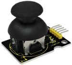 |  |  | |
| Joystick Module*1                                            | Keyestudio PCF8591 A/D Converter Module*1                    | Jumper Wires                                                 | M-F Dupont Line                                              |

#### 3. Component Knowledge

This is a joystick very similar to the ‘analog’ joysticks on PS2 (PlayStation 2) controllers. It is a self-centering spring loaded joystick, meaning when you release the joystick it will center itself. It also contains a comfortable cup-type knob/cap which gives the feel of a thumb-stick.

It has three signal pins which are connected GND, VCC and signal end（B, X, Y). The X pin is **X-axis** (left to right), the Y pin is **Y-axis** (front and back) and signal B end is Z-axis(usually used as digital port and pushbutton)

VCC is connected to V/VCC（3.3/5V）of MCU, GND to G/GND of MCU and the voltage is around 1.65V/2.5V in initial status

X axis gives readout of the joystick in the horizontal direction (X-coordinate) i.e. how far left and right the joystick is pushed.

Y axis gives readout of the joystick in the vertical direction (Y-coordinate) i.e. how far up and down the joystick is pushed.

Z axis is the output from the pushbutton. It’s normally open, meaning the digital readout from the SW pin will be HIGH. When the button is pushed, it will connect to GND, giving output LOW.

#### 4. Schematic Diagram：

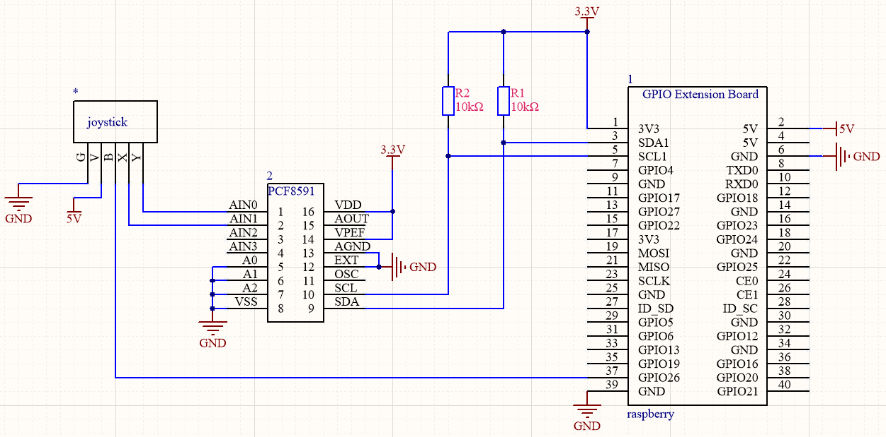


#### 5. Run Example Code：

<span style="color: rgb(255, 76, 65);">Note:</span> in the experiment, I2C communication is used. We need to check the iic address first(<span style="color: rgb(255, 76, 65);">enter command：i2cdetect -y 1 and press“Enter”. If failed, check the wiring is correct or not. If correct, you need to enable I2C communication function of Raspberry Pi, project 19 is for your reference.</span>)
<br>
<br>
After enabling the I2C communication，input the following commands and press "Enter":

cd /home/pi/pythonCode_A

python 31_joystick.py

#### 6. Test Results：

Rotate Joystick , terminal will show the responding data change and press it,“The key is pressed”is displayed in the terminal.

<span style="color: rgb(255, 76, 65);">Note:</span> Press Ctrl + C on keyboard and exit code running.

#### 7. Example Code：

```python
import RPi.GPIO as GPIO
import smbus   
import time

GPIO.setmode(GPIO.BCM)
GPIO.setwarnings(False)

key = 26  ## joystic button pin
GPIO.setup(key,GPIO.IN)
 
address = 0x48 ###address  ---> device address
cmd = 0x40     ###DA converter command
A0 = 0x40      ###A0  ----> port address
A1 = 0x41
A2 = 0x42
A3 = 0x43
bus = smbus.SMBus(1)            ###start the bus

def analogRead(count):   ##function,read analog data
    read_val = bus.read_byte_data(address,cmd+count)
    return read_val

while True:                     ###loop 
    ##Vout = 10                  ###10*0.0196=0.196V
    ##bus.write_byte_data(address,cmd,Vout) ###DA converter
    x_val = analogRead(0) ###read A0 data
    y_val = analogRead(1) ##read A1 data
    print("x:%1.0f  y:%1.0f" %(x_val,y_val))          ###print data
    if GPIO.input(key):   
        print("The key is presed")   


GPIO.cleanup()
```

### Project 32： Ultrasonic

#### 1. Description：

An ultrasonic sensor is an electronic device that measures the distance of a target object by emitting ultrasonic sound waves, and converts the reflected sound into an electrical signal.

#### 2. Components：

|  |  |  | | 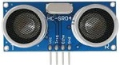 |   |
| ------------------------------------------------------------ | ------------------------------------------------------------ | ------------------------------------------------------------ | ------------------------------------------------------------ | ------------------------------------------------------------ | ------------------------------------------------------------ |
| Raspberry Pi*1                                               | GPIO Extension Board*1                                       | 40 pin Colorful Jumper Wires*1                               | Breadboard*1                                                 | HC-SR04 Ultrasonic Sensor*1                                  | Jumper Wires                                                 |

#### 3. Component Knowledge

The ultrasonic module will emit the ultrasonic waves after trigger signal. When the ultrasonic waves encounter the object and are reflected back, the module outputs an echo signal, so it can determine the distance of object from the time difference between trigger signal and echo signal.

The t is the time that emitting signal meets obstacle and returns and the propagation speed of sound in the air is about 343m/s, therefore, distance = speed \* time, because the ultrasonic wave emits and comes back, which is 2 times of distance, so it needs to be divided by 2, the distance measured by ultrasonic wave = (speed \* time)/2

1.  Use method and timing chart of ultrasonic module:

2.  Setting the delay time of Trig pin of SR04 to 10μs at least, which can trigger it to detect distance.
    
3.  2\. After triggering, the module will automatically send eight 40KHz ultrasonic pulses and detect whether there is a signal return. This step will be completed automatically by the module.
    
4. 3\. If the signal returns, the Echo pin will output a high level, and the duration of the high level is the time from the transmission of the ultrasonic wave to the return.

   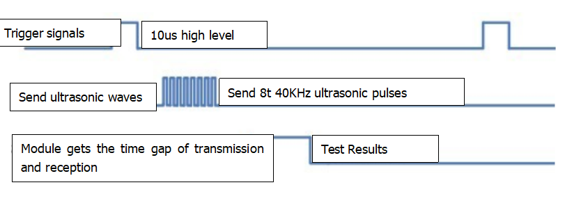

#### 4. Schematic Diagram：


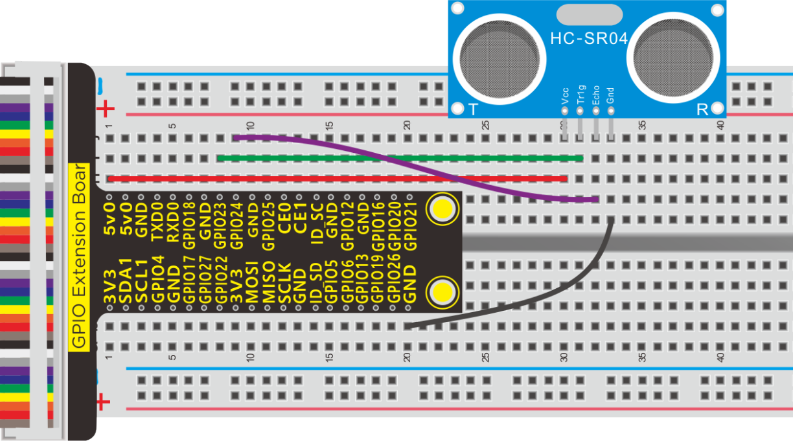

#### 5. Run Example Code：

Input the following commands and press "Enter":

cd /home/pi/pythonCode_A

python 32_ultrasonic.py

#### 6. Test Results：

Terminal prints the detected distance, unit is cm.

<span style="color: rgb(255, 76, 65);">Note:</span> Press Ctrl + C on keyboard and exit code running.

#### 7. Example Code：

```python
import RPi.GPIO as GPIO
import time
 
GPIO.setmode(GPIO.BCM)
  
##define GPIO pin
GPIO_TRIGGER = 23
GPIO_ECHO = 24
  
##set GPIO mode (IN / OUT)
GPIO.setup(GPIO_TRIGGER, GPIO.OUT)
GPIO.setup(GPIO_ECHO, GPIO.IN)

def distance():
    ## 10us is the trigger signal
    GPIO.output(GPIO_TRIGGER, True)
    time.sleep(0.00001)  ##10us
    GPIO.output(GPIO_TRIGGER, False)
    
    start_time = time.time()
    stop_time = time.time()
    
    while GPIO.input(GPIO_ECHO) == 0:   ##Indicates that the ultrasonic wave has been emitted
        start_time = time.time()  ##Record launch time
  
    while GPIO.input(GPIO_ECHO) == 1:   ##Indicates that the returned ultrasound has been received
        stop_time = time.time()   ##Record receiving time
  
    time_elapsed = stop_time - start_time  ##Time difference from transmit to receive
    distance = (time_elapsed * 34300) / 2  ##Calculate the distance
    return distance   ##Return to calculated distance
  
if __name__ == '__main__':   ##Program entry
    try:
        while True:  
            dist = distance()  ##
            print("Measured Distance = {:.2f} cm".format(dist)) ##{:.2f},Keep two decimal places
            time.sleep(0.1)
  
        ## Reset by pressing CTRL + C
    except KeyboardInterrupt:
        print("Measurement stopped by User")
        GPIO.cleanup()
```


